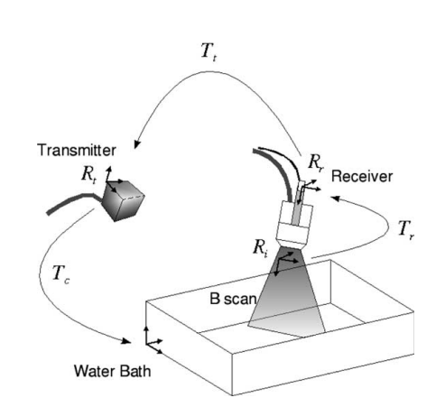

#  每个坐标系分别是什么意思

## 图像坐标系

这就是 **B-scan 本身的 2D 平面坐标系**。

在一张超声图里，你看到的点先是像素坐标 $(u,v)$。
 但像素不是毫米，所以论文先把它写成：
$$
x_i=
\begin{bmatrix}
s_x u\\
s_y v\\
0\\
1
\end{bmatrix}
$$
意思是：

- $u,v$：图像中的横纵像素位置
- $s_x,s_y$：像素间距，负责把 pixel 变成 mm
- 第三个分量是 0：因为这个点一开始就在 **B-scan 这张 2D 平面上**
- 最后那个 1：是齐次坐标写法，方便做刚体变换

所以 $R_i$ 本质上就是：

**“这张超声切片自己的局部平面坐标系。”**

------

## receiver 坐标系

这是装在探头上的 **位置传感器坐标系**。

图里那个探头上绑着的小传感器，就是 receiver。
 所以 $R_r$ 不是图像坐标，也不是世界坐标，而是：

**“探头上那个追踪传感器自己的坐标系。”**

为什么需要它？

因为外部跟踪系统并不直接知道 B-scan 图像平面在哪里，它只知道：

> “我测到的是这个 receiver 在空间中的姿态。”

所以你必须先知道：

**图像平面 $R_i$ 相对于 receiver $R_r$ 到底怎么放。**

这个变换就是 $T_r$。

------

## transmitter 坐标系

这是外部跟踪系统的 **参考坐标系**。

图里左边那个设备叫 transmitter，它是整个 tracking system 的参考端。
 不管是电磁定位还是某些光学/机械定位，本质上都需要一个“参考基座”。

所以 $R_t$ 可以理解为：

**“外部定位系统给你定义的世界参考系。”**

探头上的 receiver 每一时刻相对于 transmitter 的位姿，是跟踪器直接测出来的。
 这个变换就是 $T_t$。

------

## reconstruction 坐标系

这是最后做三维重建时用的坐标系。
 在这篇论文里，它就选成了 **水槽/体模坐标系**。

也就是说：

- 你最后想把所有 B-scan 都摆进同一个 3D 空间里；
- 这个统一的 3D 空间就是 $R_c$。

所以 $R_c$ 可以理解为：

**“最后三维重建结果所依附的空间坐标系。”**

在图里，水槽就是 phantom，所以 $R_c$ 也可以看成 phantom 坐标系。


## 方法整体思路

这篇方法分成三大块：

1. **准备一个平面体模**，让它在每张超声图里显示成一条强直线；
2. **从每张 B-scan 里自动提取这条线对应的点**；
3. **联合优化“平面参数 + 标定参数”**，让这些点尽量落到同一个真实平面上。

## 怎么做

下面我按“真正落地复现”的顺序讲。

### 第 1 步：准备硬件和体模

你需要：

- 一把普通 2D 超声探头；
- 一个安装在探头上的位置跟踪器；
- 一个 **平面体模**：论文里用的是 **水槽中的有机玻璃平板**。这样做的原因很简单：平面在 B-scan 中会形成一条明显的强回声直线，容易自动检测。

------

### 第 2 步：采集一段扫查序列

你要做的是让探头在水槽平面上方做一段自由扫查，同时记录两类数据：

- 每一帧 B-scan 图像；
- 每一帧对应的跟踪器位姿 $T_t$。

这里有个很重要的细节：
 论文强调 **第一帧最好让探头大致垂直于平面**，因为这会让后面的初始化更容易。

### 第 3 步：在每张 B-scan 中找候选点

这一部分是方法的第一核心。

论文不是直接做整条线分割，而是先在每张图上提取一批“可能属于平面回波线”的点。做法是：

- 计算图像的 **亮度**；
- 计算图像的 **梯度**；
- 对亮度和梯度分别设阈值；
- 同时满足“高亮度 + 高梯度”的点被保留下来。

### 第 4 步：对每一帧做 2D 直线检测

有了候选点之后，论文用 **Hough 变换** 来找直线。Hough 的思想是：

- 图像空间里共线的一批点，
- 在参数空间 $(r,\theta)$ 中会交汇到一个峰值；
- 这个峰值就对应一条最可信的直线。

论文把每帧直线写成：
$$
ax + by + c = 0
$$
然后再做一次筛选：

- 计算每个候选点到这条直线的欧氏距离；
- 只保留“离直线足够近”的点。

所以这一步结束以后，每一帧你就得到了：

- 一条检测到的平面回波线；
- 一组真正贴着这条线的点。

### 第 5 步：做跨帧 3D/时序一致性检查，删掉坏帧

论文认为：如果探头运动是连续的，那么每帧里检测到的直线参数 $a,b,c$ 也应该随时间 **平滑变化**。于是它把直线参数重参数化成 $(a/b, c/b)$，然后：

1. 对整段序列的参数变化曲线做 **B-spline 拟合**；

2. 计算每一帧真实参数与拟合曲线之间的差值；

3. 把这些差值视为随机变量 $X_i$；

4. 做假设检验，如果
   $$
   |X_i|/\sigma > 1.96
   $$
   就认为这帧是异常帧，剔除。

你可以把这一步理解成：

**前一步是在“每帧内部找线”，这一步是在“全序列层面检查这条线是不是连贯”。**

这很重要，因为单帧看起来像直线的噪声，有时会骗过 Hough；但如果它和前后帧完全不连续，就会在这里被淘汰。

### 第 6 步：建立标定目标函数

接下来就进入数学求解。

论文同时估计两类未知量：

- 标定参数：$T_r$ 和 $s_x, s_y$；
- 平面参数：真实水槽平面在重建坐标系里的参数。

为什么连平面参数也一起估？

因为在临床或实际环境中，那个平面在重建坐标系里并不是事先已知的，所以不能假设它已经精确对齐。

论文提出了两种目标函数。

#### 方案 A：3D 距离最小化

让所有兴趣点变换到 3D 空间后，尽量贴近同一个真实平面：
$$
\hat T_r = \arg\min_T \frac12 \sum_{i=1}^{N} d_{3D}(p, M_i)^2
$$
这里 $d_{3D}(p,M_i)$ 是 3D 点到平面的欧氏距离。

#### 方案 B：2D 距离最小化

把平面投影回每张 B-scan，最小化图像中点到投影线的距离：
$$
\hat T_r = \arg\min_T \frac12 \sum_{i=1}^{N} d_{2D}(P(p), m_i)^2
$$
这里 $d_{2D}$ 是图像平面中的距离。

这两种方法本质上都对，但论文实验表明：

- **3D 方案更稳定、更准确一些**；
- **2D 方案更直观地贴近图像平面计算**；
- 两者都优于对比方法 StradX。

------

### 第 7 步：初始化

优化前必须给个初值，否则非线性问题容易跑偏。

论文的初始化策略很朴素：

- 第一帧假设探头大致垂直于平面；
- 利用第一帧的 3D 坐标对平面参数做初始估计；
- 探头和传感器之间的夹具几何关系给出 $T_r$ 的粗略初值。

换成你实际复现时的做法就是：

- $t_x,t_y,t_z$ 给一个大致量级正确的值；
- 旋转角不要离真实值太夸张；
- $s_x,s_y$ 用设备标称像素间距做初值；
- 平面法向量从第一帧的线方向粗估。

论文在合成实验里测过较大的初始化范围，发现方法对初值有一定鲁棒性，尤其是 3D 准则更稳定。

------

### 第 8 步：用 Levenberg–Marquardt 做联合优化

这一步是方法的求解核心。

论文使用 **Levenberg–Marquardt（LM）** 算法来同时估计：

- 外参 $T_r$；
- 尺度 $s_x,s_y$；
- 平面参数。

为什么用 LM？

因为这个问题是一个标准的 **非线性最小二乘** 问题，而且目标函数对参数是可导的。

你在实现时要做的事就是：

1. 给定当前参数；
2. 把每个图像点根据 $T_t$、$T_r$、$s_x,s_y$ 映射到 3D；
3. 计算它到平面的距离，或者图像上的投影距离；
4. 累积残差；
5. LM 更新参数；
6. 迭代直到收敛。

------

### 第 9 步：分层优化，加快速度

论文没有一上来就拿全部点做 LM，而是用了一个很实用的技巧：

- 第一轮只用 **1/3 的点**；
- 第二轮用 **2/3 的点**；
- 第三轮再用 **全部点**。

这样做的好处是：

- 前期搜索快；
- 不容易一开始就被大量噪声拖慢；
- 后期再精细化。

这和多分辨率思想很像，只不过这里不是图像金字塔，而是 **点集规模分层**。

如果你自己复现，我会建议你直接照这个三阶段来，不要一开始就全点开 LM。

------

### 第 10 步：在优化过程中做鲁棒去异常

光靠前面的阈值、Hough、时序筛选，还不够。因为超声里有散斑噪声，仍可能残留离群点。

所以论文在优化阶段又用了 **Least Trimmed Squares, LTS**。它不是对所有残差平方和求和，而是：

- 先把残差从小到大排序；
- 只取最小的前 $h$ 个残差平方求和；
- 最大的那一部分看成离群点，不参与本轮优化。

公式写成：
$$
\hat T = \arg\min_T \sum_{i=1}^{h} r_i^2,\qquad N/2 \le h \le N
$$
论文选择 LTS 的理由也很明确：

- 鲁棒；
- 抗离群点能力强；
- 只需要调一个参数，即每帧异常点比例。

这一步非常关键。你可以把它理解成：

**前面是“检测坏点”，这里是“即使坏点混进来了，也别让它把优化带偏”。**


# 拆帧

```bash
mkdir -p frames
gst-launch-1.0 -e \
  filesrc location="video_49919.mkv" ! decodebin ! videoconvert ! jpegenc ! \
  multifilesink location="frames/frame-%06d.jpg"
```


# 问题

## 初始化的重要性

需要知道探头和传感器的安装关系

Tr 就是这层几何关系的数学表达；你先粗测安装关系，等于先把 Tr  的初值放到合理位置，这会显著提高初始化质量。

### 要怎么设置初始化

## 一、6DoF 外参到底是哪 6 个

就是这 6 个量：
$$
(tx, ty, tz, rx, ry, rz)
$$
也就是：

- **3 个平移**：图像平面原点相对 sensor 原点“挪了多少”
- **3 个旋转**：图像平面相对 sensor “转了多少角度”

它们合起来就是一个**刚体变换**。
 ImFusion 的超声标定实现里，默认优化的也正是 calibration matrix 里的 **translation 和 rotation**，而不是 temporal calibration 和 image size。

你可以把它想成：

- tracker 告诉你：**sensor 现在在世界里哪里**
- calibration 告诉你：**图像平面相对 sensor 在哪里**
- 两个一乘，就知道：**这一帧 B-scan 在世界里哪里**

典型坐标链就是：
$$
T_{\text{world}\rightarrow \text{image}}
=
T_{\text{world}\rightarrow \text{sensor}}
\cdot
T_{\text{sensor}\rightarrow \text{image}}
$$
这里真正要标定的，就是后面这个
$$
T_{\text{sensor}\rightarrow \text{image}}
$$
。这个解释和综述里“tracking system tracks the sensor on the probe, not the image plane itself; calibration finds the transformation between the sensor and the image plane”是完全一致的。

------

## 二、“旋转初值”那句话到底是什么意思

我换成最直白的话：

**先把你心里假设的 B-scan 平面，摆到一个大致合理的朝向。**

因为你还没优化之前，程序并不知道图像平面到底朝哪边。
 如果你把初始朝向设得太离谱，比如：

- 图像平面朝后面
- 图像平面侧着插出去
- 左右翻了 90° 或 180°
- 法向反了

那优化很容易跑飞，或者掉进错误局部极值。ImFusion 文档也明确说，输入 sweep 需要 **roughly initialized**，而且初始化质量会影响优化结果。

### 你可以这样理解“法向对齐”

B-scan 图像本质上是一张**二维切片平面**。
 这个平面在现实空间里一定有个朝向，也就是它的“正面朝哪边”。

工程上初始化时，你通常会先假设：

- 图像平面是从**探头发射面**“打”出去的
- 它大致位于探头前方
- 它不是横着飞出去，也不是朝探头后面

所以“按探头表面法向和图像平面法向对齐”，意思不是某个神秘公式，而是：

**先让你的图像平面朝向，看起来像是真的从探头里扫出来的那一张切片。**

------

## 三、“平移初值”那句话到底是什么意思

这句话的意思是：

**先手工估计一下，sensor 原点到图像平面原点有多远。**

因为 tracker 给你的是 sensor 的位置。
 但超声成像真正对应的，是探头前方那张 B-scan 平面。
 这两者中间通常隔着一段固定距离。

所以你要先给一个粗略初值，比如：

- sensor 安装在探头上方
- 图像平面在探头前端下面一点
- 两者相距几厘米

那就给一个大概的 $t=(tx,ty,tz)$。

这个量不需要很准，**量级对就行**。
 ImFusion 也明确提到要把 calibration 初始化到 optimizer 的有效捕获范围内，初始化差时还要调 step size。

------

## 四、你现在可以把它具体想成这样

假设你有这几个坐标系：

- **W**：世界坐标系 / tracker 世界系
- **S**：绑在探头上的 sensor 坐标系
- **I**：超声图像坐标系

那么：

- tracker 每一帧给你的是
  $$
  T_{W\rightarrow S}
  $$

- 你要标定的是
  $$
  T_{S\rightarrow I}
  $$

而这个 $T_{S\rightarrow I}$ 就由 6DoF 组成：
$$
T_{S\rightarrow I}
=
\begin{bmatrix}
R & t\\
0 & 1
\end{bmatrix}
$$
其中：

- $R$：3 个旋转参数
- $t$：3 个平移参数

所以你说的“先只优化 6DoF 外参”，就是：

**第一轮先只优化 $R,t$，别同时去碰 scale、time delay 这些别的参数。**
 这也正是现有实现里常用的默认策略。

------

## 五、给你一个特别具体的直觉例子

假设你的光学 tracker 小方块装在探头背面。
 你肉眼看上去大概是这样：

- sensor 原点比探头发射面**高 30 mm**
- 图像平面中心大概在探头前方 **10 mm**
- 左右基本居中
- 图像平面朝前，不朝后

那你的初始化就可以理解成：

- **平移初值**：先设成“前 10 mm、左 0 mm、下 30 mm”这种量级
- **旋转初值**：先设成“图像平面朝前，与探头长轴大致一致”

这就叫“粗初始化”。

不是说这一定是最终正确值，
 而是说它已经把解放进了优化器比较容易收敛的区域里。ImFusion 文档里的 roughly initialized，本质就是这个意思。

------

## 六、为什么我一直说“先只优化 6DoF”

因为 Confhusius 原文提到 calibration 里既有 translation、rotation，也有 scaling。
 但在工程上，**scale 往往能从超声设备读出来**，而 temporal offset 又容易和空间误差耦合，所以第一轮如果全开，问题会更难、也更不稳。相反，现有工具默认只开 translation 和 rotation，就是为了降低耦合。

所以你现在最实用的做法是：

### 第一轮只放开这 6 个

- tx
- ty
- tz
- rx
- ry
- rz

### 先不要放开这些

- x/y 像素尺度
- temporal offset
- 其他额外畸变参数

------

## 七、你代码里通常长这样

如果你代码里是用欧拉角：

```
params = [tx, ty, tz, rx, ry, rz]
```

如果你是用旋转矩阵/四元数：

- 平移还是 3 个
- 旋转可能内部不是 3 个存，但本质上仍然是 **3 个自由度**

所以“6DoF 外参”说的是**自由度**，不一定等于你代码里参数数组就正好 6 个数字。

------

## 八、你现在最需要避免的几个误解

### 1. 6DoF 不是 tracker 的 pose

不是。
 tracker 每帧已经给了 sensor 的 pose。
 你要标定的是 **sensor 到 image plane 的固定相对变换**。

### 2. 旋转初值不是让你去算 phantom 的法向

不是。
 这里说的是**图像平面相对探头/sensor 的朝向初值**。

### 3. 平移初值不是每帧都变

不是。
 这是一个**固定外参**，只要 sensor 和探头是刚性绑定的，它应该是常数。

------

## 九、最简版本你就这么记

**6DoF 外参 = 图像平面相对探头上传感器的固定刚体变换**

包括：

- 3 个平移：图像平面离 sensor 多远
- 3 个旋转：图像平面相对 sensor 朝哪边

**旋转初值**：先把图像平面摆成“像是真的从探头里扫出去”的方向。
 **平移初值**：先把图像平面放到“离 sensor 几厘米远的合理位置”。
 **先只优化 6DoF**：第一轮只调这 6 个，不同时去调尺度和时延。

你把你现在的坐标定义发我，比如：

- sensor 坐标系轴方向
- image 坐标系原点放在哪
- 你现在的 `T_sensor_image` 是左乘还是右乘

我可以直接给你画成一张坐标关系图，并告诉你这 6 个初值应该怎么填。

