# BifrostUMI

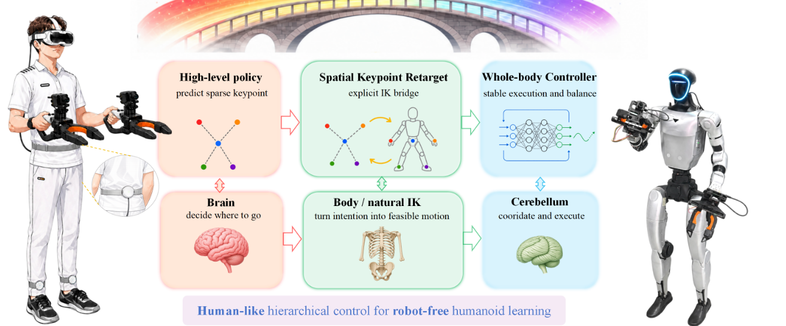

## 值得注意的

**TWIST² 和 Touch Dreaming** 采用基于遥操作的数据采集方式，并学习**直接预测机器人级动作**的策略，例如关节命令或关节目标。 提供了从感知到控制的端到端接口，但策**略学习对机器人形态和控制器设计更加敏感**

**HuMI** 采用了另一种方法：它预测任务空间中的关键点，并训练一个低层控制器，将这些关键点命令转换为可执行的全身动作。 但是逆运动学和重定向过程在很大程度上被嵌入到了学习得到的低层控制器内部，使得中间运动表示不够显式。 不容易解释、不容易调试，也不容易迁移。

HuMI 直接将关键点级命令输入低层控制器，并依赖学习策略隐式解决逆运动学问题，

### 数据采集

```bash
    左手 pose，右手 pose，pelvis pose，left-foot pose，right-foot pose
    左手腕相机图像，右手腕相机图像
    左夹爪宽度，右夹爪宽度
    实时retargeting 后的机器人下半身关节状态
```

### High Level: Diffusion Policy

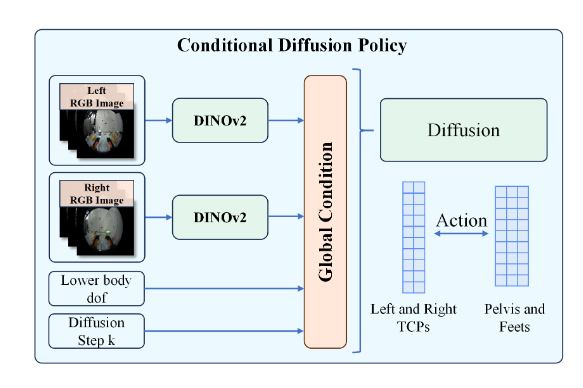

#### 输入

1 帧左腕部 RGB 图像
1 帧右腕部 RGB 图像
3 帧历史 lower-body proprioception   SKR的输出

##### **监督目标 target**

未来 48 帧的五个关键点相对轨迹 + 夹爪宽度

##### *数据表示*

*数据表示：关键点由一个 3 维平移和一个 6 维连续旋转表示组成，因此每个关键点是 9 维，总共 5 *9 = 45 维（绝对坐标）*

 *每个关键点用自己的局部坐标系表示未来位姿：预测左手未来相对于当前左手坐标系的运动*

​	*第一个好处：**不依赖世界坐标系***

​	*第二个好处：**减少关键点之间的噪声耦合**   如果所有关键点都以 pelvis 为基准，那么 pelvis 的误差会传递给手和脚。*


#### 输出

归一化后的、每个关键点相对于自身当前坐标系的未来轨迹

反归一化, 转换为绝对 SE(3)目标，然后被传递给 SKR 模块，


### Keypoint Retargeting System

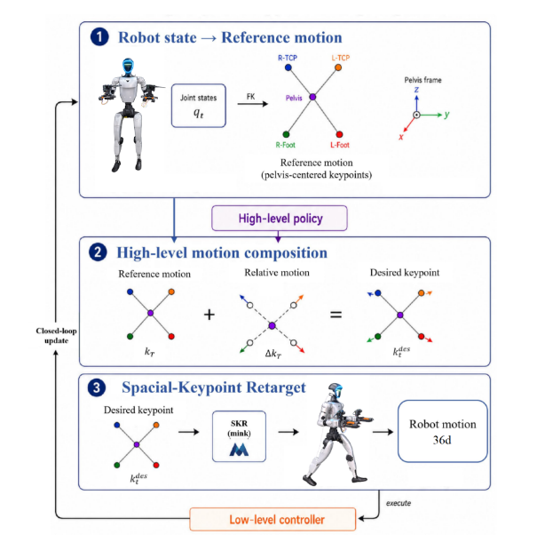

#### Human Gap

注意： 人和机器人之前的GAP，**只对骨盆到脚之间的竖直距离进行缩放**，以补偿人类和机器人之间的身高差异。


1、在部署过程中，系统首先通过  SDK 读取机器人关节状态，并以骨盆坐标系作为参考坐标系计算正运动学，得到关键点的 reference motion

2、当前 reference motion + 相对运动 Δk

3、mink 逆运动学求解   29+3+4=36

### Whole-Body Controller

#### 输入

The proprioceptive input and the motion-command input,  Observation = current robot state + reference command

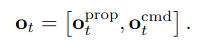


Reference command：

For each temporal offset k, the command is defined as


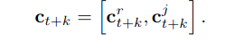

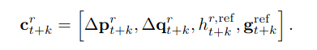

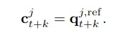

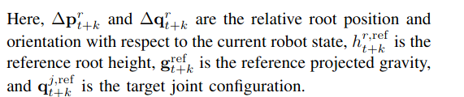

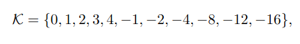

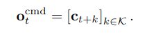


Proprioceptive input: 

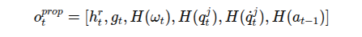


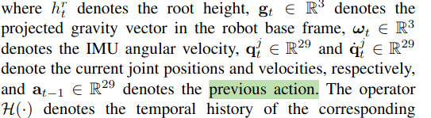


#### 输出

ONNX policy


#### 采样频率

根部位置和关节位置，使用线性插值；对于根部姿态，则使用球面线性插值。


### EXPERIMENTS

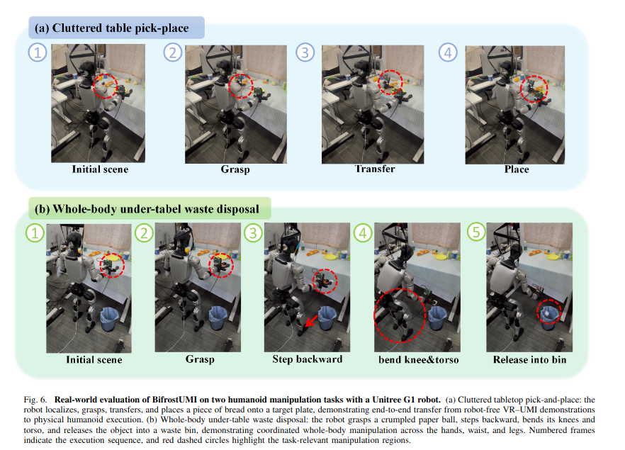


# HuMI

## 数据采集

以全身轨迹和图像观测的形式采集人类示范数据。

我们采用一种标准的全身追踪配置，重点追踪五个关键操作坐标系：骨盆，即浮动基座、双手和双脚


设备选择五个 HTC Vive Ultimate Tracker，以确保稳定的全身追踪，安装在夹爪、腰部和双脚上


#### Human Gap

 Unitree G1 大约 130 厘米，  Scaling is applied exclusively to the **height of the pelvis tracker**. 

通过一个在线 IK 预览接口，操作者可以即时调整自己的示范，从而同时满足机器人可行性和任务约束。

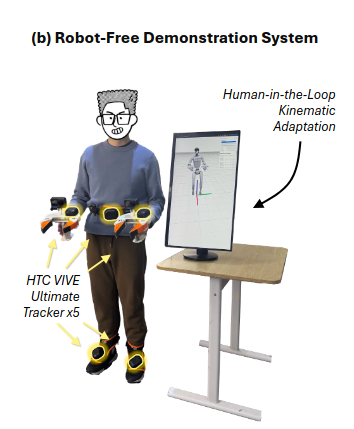

## 数据处理

记录的数据包括来自夹爪相机的 MP4 视频，以及来自五个追踪器的带时间戳 SE(3) 轨迹。

1、同步时间戳      

2、夹爪宽度提取，检测安装在夹爪上的 ArUco 标记，从录制视频中提取夹爪开合宽度。

3、数据被打包成两个子集：

- 用于训练高层策略的视觉观测、夹爪宽度和关键点轨迹；

- 用于训练低层控制器的关键点轨迹，以及与之配对的全身 IK 解。

  

## Diffusion policy

### 监督信号

Relative pose tracking for **non-vision-grounded** keypoints.

对于 pelvis 来说，relative tracking 的参考就是当前 action chunk 起点处的 pelvis pose；后续只控制 pelvis 相对这个起点怎么变化

### 输入

-  左右腕部 GoPro 图像
-  Proprioceptive data：机器人本体状态，机器人的下半身关节角组成


### 输出

- desired end-effector keypoint trajectories
-  gripper commands


## Whole-Body Controller


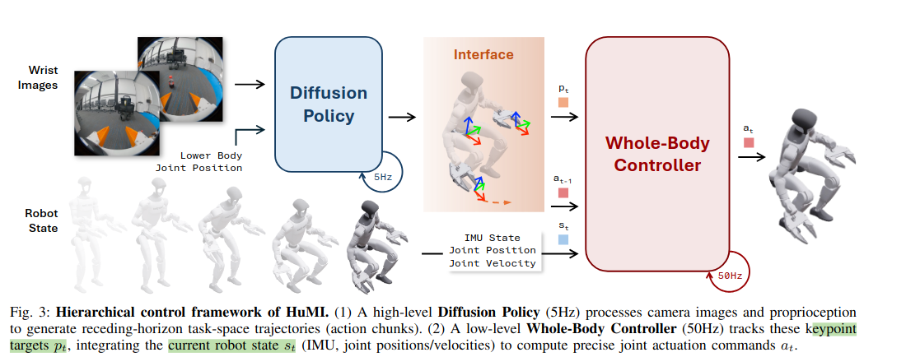

```
腕部图像 + 机器人下半身关节状态
        ↓
高层 Diffusion Policy，5Hz
        ↓
目标关键点轨迹 p_t， relative keypoint trajectories，
        ↓
低层 Whole-Body Controller，50Hz
        ↓
关节动作命令 a_t
        ↓
机器人执行全身操作
```


### Global localization

在机器人骨盆上安装一个 HTC Vive Ultimate Tracker 用于全局定位，

并在地面放置第二个 tracker，作为静态的  Z= 0参考坐标系。


### Teacher–student framework

Teacher 在仿真中利用 privileged **全身参考信息**学会高质量 tracking；

Ttudent 通过 DAgger 学会只依赖真实机器人状态和高层 policy 输出的 keypoint action chunks


```
DAgger 是 Dataset Aggregation，一种 imitation learning 方法。
简单理解就是：student 在自己运行过程中收集状态，然后让 teacher 给出对应动作标签，再不断训练 student 模仿 teacher。
```

#### Teacher observation

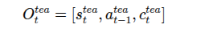

 teacher 状态、上一时刻动作和 teacher 命令组成。

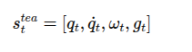

*包括全身关节位置 、全身关节速度 、基座角速度 ，以及投影到机体坐标系下的基座重力向量。*


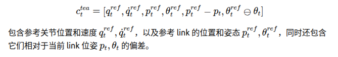

参考关节是指全身关节，可以通过IK，也可以来自其他完整的数据

参考 link 的位置和姿态通过由参考关节的pose ， forward kinematics 得到


#### Student observation

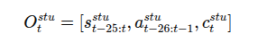

过去一段时间的状态历史、动作历史，以及当前 student 命令。

##### 状态历史

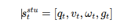

##### student 命令


每个部分都包含未来 2 秒内采样的 10 个路径点。 有视觉锚点的 end-effector 关键点，  没有视觉锚点的 blind keypoints


######  End-Effector 关键点

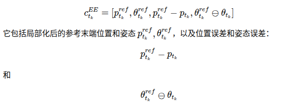

**没有明确是那个局部坐标** 可能和上面的Global localization 有关

###### Blind keypoint 

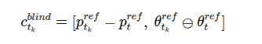

在一个chunk内，k时刻相对于起始点的变化


### WBC两个改进

#### Adaptive end-effector tracking.

慢速精细操作时，严格要求手部精度；快速全身运动时，放松手部精度，优先保证稳定。

#### Variable-speed augmentation

训练时让参考动作有时快、有时慢，尤其加入慢速版本，让 policy 有更多时间学习修正误差。


# TWIST2

## 数据采集

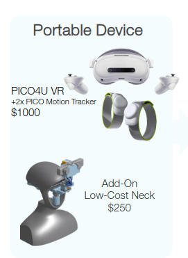

2 DoFs neck (yaw and pitch)


## Hierarchical Policy

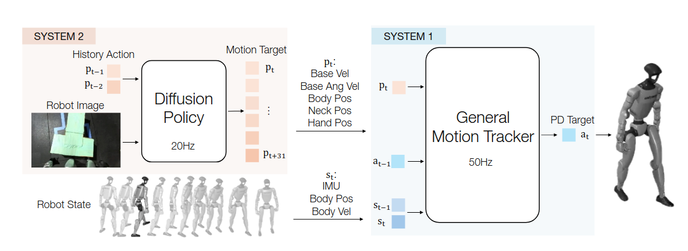

### 需要注意

其实是有Retarget的，从Pcmd里面包含的是全身的joint看出


## Low-level control

#### 数据来源：

一部分是通过 GMR 重定向得到的数据，共 7000 条动作片段；
 另一部分是来自 TWIST 原始动作数据集的数据，共 13000 条动作片段。

通过 PICO 采集了 73 条动作

### Reference command


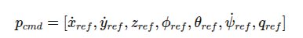

Root translational velocity in the x and y axes, root z position, root roll/pitch angles, root yaw angular velocity, and **whole body joint positions**（说明经过了Retargeting）


#### Trick 1

Relative root 

使用相对的 root 平移和旋转


#### Trick 2

Include whole-body joint positions

包含全身关节位置，而不是像一些方法那样把下半身控制简化为仅跟踪 root 速度


### Proprioception

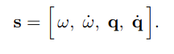

Root orientation and angular velocity from IMU readings, as well as joint positions and velocities from encoders:


### Train

通过强化学习，让机器人在仿真中执行动作，并根据跟踪效果得到 reward。

 PPO 进行训练，并且主要由两部分组成：卷积式历史编码器和 MLP 主干网络。（没有明确convolutional history encoder 是什么）

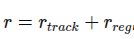

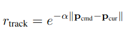


## High-level control

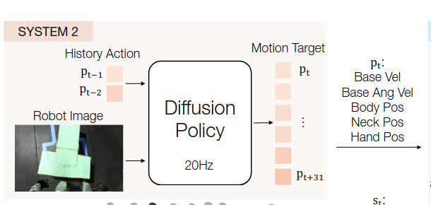

```
输入：
1. visual observations 视觉观测
2. proprioceptive information 本体感知信息：使用历史命令序列pcmd，而不是原始机器人状态 s。

输出：
motion commands 运动命令 p_cmd
```


### Trick 1

$$
机器人本体感知信息，我们使用历史命令序列 p_{cmd}，而不是原始机器人状态 s。
$$

第一，它将高层策略与低层控制器解耦，从而支持模块化训练和部署。

高层只看历史 p_{cmd}，这样高层策略更像在学习：

```
视觉 + 历史高层命令 → 下一段高层命令
```

第二，它避免直接依赖带噪声的原始机器人状态 


### 输出

Diffusion Policy is converted to ONNX format


# 三篇论文对比

## 整体比较

| 对比维度                 | **TWIST2**                                                  | **HuMI**                                                     | **BifrostUMI**                                               |
| ------------------------ | ----------------------------------------------------------- | ------------------------------------------------------------ | ------------------------------------------------------------ |
| 核心目标                 | 建立可扩展、便携、无 MoCap 的**真机遥操作与数据采集系统**   | 建立**robot-free** 的全身操作示范采集与学习框架              | 建立 robot-free 示范到机器人执行之间更清晰的**显式桥接框架** |
| 数据采集时是否需要机器人 | **需要机器人**，是遥操作系统                                | **不需要机器人**，人用传感器/夹爪采集示范                    | **不需要机器人**，用 VR/UMI 式设备采集人类示范               |
| 高层策略输入             | 机器人第一视角视觉 + 历史 motion command                    | 腕部相机图像 + proprioception                                | 腕部相机图像 + 机器人本体状态                                |
| 高层策略输出             | **未来 whole-body joint positions / motion commands**       | **任务空间 keypoint trajectories + gripper commands**        | **未来 5 个 keypoint 轨迹变化 + gripper width**              |
| 中间表示                 | 机器人级 `p_cmd`，包含 root + 全身关节                      | 任务空间关键点，主要是 end-effector / pelvis / feet          | 任务空间 5 keypoints，然后经 SKR 显式转为 robot-native motion |
| retargeting 位置         | 在遥操作/数据生成阶段已经完成，`p_cmd` 已经是机器人相关命令 | 部分 retargeting / IK 被低层控制器隐式吸收                   | **显式 SKR 模块**：keypoints → root pose + joint positions   |
| 低层控制                 | RL motion tracker，跟踪机器人级 reference command           | Teacher-student WBC，student 只看真实可部署状态和 keypoint command | WBC 跟踪 SKR 产生的 36D robot-native motion                  |
| 优点                     | 数据是机器人一致的，执行链路直接，适合真机遥操作和模仿      | 不依赖机器人采集，效率高，适合跨场景示范                     | 模块最清晰，可解释、可调试、可迁移性更好                     |
| 主要代价                 | 采集需要真机，数据和机器人 embodiment 绑定更强              | 中间表示到机器人动作的映射不够显式                           | 需要设计和维护 SKR / IK 桥接模块                             |


## WBC比较

 最核心的：底层控制器吃什么 command？

| 论文           | 底层控制器输入的 reference command                         | 底层控制器本质任务                   | 输出                                          |
| -------------- | ---------------------------------------------------------- | ------------------------------------ | --------------------------------------------- |
| **TWIST2**     | root 速度/姿态 + **whole-body joint positions**            | 跟踪机器人级全身运动参考             | desired joint positions，再由 PD 执行         |
| **HuMI**       | **keypoint targets**，如双手、骨盆、双脚**相对root的轨迹** | 学会把 keypoint 目标转成全身关节动作 | robot joint angles / joint actuation commands |
| **BifrostUMI** | SKR/IK 后的 **root pose + 29 DoF joint configuration**     | 跟踪机器人原生全身 reference motion  | 29 维 action / joint command                  |


# SONIC


第一，我们开发了一个用于交互控制的通用运动学动作生成系统，通过在动作空间中进行运动学规划

例如用户给一个目标：

```
向左走
转身
跑到某个位置
蹲下
跳跃
```

kinematic planner 先生成合理的人体动作，然后 SONIC 控制机器人执行。


第二，我们设计了一个支持多模态控制的统一 token 空间。

它可以通过统一接口接收来自遥操作、人类视频、音乐、文本以及视觉-语言-动作模型的输入。

借助统一 token 空间，我们的控制器可以支持跨 embodiment 的动作跟踪，即将估计得到的人体全身动作直接映射为人形机器人的控制信号，从而绕过传统 retargeting 的需求。


总的来说：

我们提出了一个用于交互控制的运动学**动作生成系统**，以及一个支持多模态输入的**统一 token 空间**，这些输入包括遥操作、人类视频、动作命令和 VLA 基础模型；整个过程通过单阶段训练完成，**不需要蒸馏。**


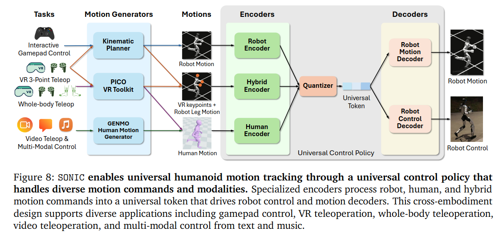

主要创新并不在Motion Generator中，主要是能够将不同形式的动作映射到统一的Token 空间，并能通过Decoder 把他们 映射到机器人上。


## Universal Control Policy

目的：我现在有三种不同的运动方式，怎么映射到真机上


#### States.

$$
状态表示 s_t 由两个部分组成：本体感知信息 s_t^p \ \ \ 和动作命令 s_t^g
$$

$$
本体感知信息 s_t^p \triangleq (q_t,\dot{q}_t,\omega_t,\psi_t,a_{t-1})
$$

 joint pose、joint velocity、root angular velocity、gravity vector 、 previous action


$$
s_t^g 有三种类型：机器人动作 g^r、人体动作 g^h，或者混合动作 g^m
$$

##### 坐标系

所有状态量都表示在机器人的局部 heading 坐标系中，以保证旋转不变性。


#### Actions

$$
策略 \pi 输出目标关节位置 a_t 作为动作
$$

SONIC policy 不直接输出 torque，而是输出目标关节角。


#### Rewards

$$
r_t = R(s_t^p, s_t^g) + P(s_t^p, a_t)，它由动作跟踪奖励项和惩罚项共同组成。
$$

tracking reward：跟踪目标动作越准越好
penalty term：动作越平滑、安全、合理越好


#### Universal Control Policy

通过专门设计的编码器实现跨 embodiment 学习，这些编码器将来自人类和机器人 embodiment 的异构输入处理成共享潜在表示。

不同输入格式差异很大：

```
robot motion：机器人关节位置和速度
human motion：人体 3D 关节点位置
hybrid motion：头和手关键点 + 机器人腿部动作
```

SONIC 用不同 encoder 把它们映射到同一个 shared latent space。

随后经过量化，得到一个 universal token；

这个 universal token 接着驱动一个共享的机器人控制解码器生成电机命令。


##### Encoders

$$
E_r：Robot  \ Motion\  Encoder \\
E_h：Human\ Motion \ Encoder \\
E_m：Hybrid\ Motion \ Encoder
$$

$$
E_r 编码未来 F_r 帧内的机器人关节位置和关节速度 \\

E_h 编码未来 F_h帧内的人体三维关节位置 \\

E_m 编码当前帧的稀疏上半身关键点，即头部和双手；同时结合未来 F_m 帧内的机器人下半身动作
$$


编码器都使用多层感知机 MLP 实现


#####  Quantizer

编码得到的潜在表示会通过向量量化器被量化为 universal token z。

##### Decoders

Universal token z 会通过两个独立的解码器进行解码。

- 机器人控制解码器 D_c 将 universal token 转换为控制机器人关节的电机命令。
- 机器人动作解码器 $D_r$ 会重建机器人动作命令，从而提供辅助监督，用于改善潜在空间并增强特征学习。

#####  Training

为三种动作命令类型准备了同步的动作数据。
$$
robot\ motion\ g^r \\
human\ motion\ g^h \\
hybrid\ motion\ g^m
$$

$$
g^r → E_r → quantizer → z^r \\
g^h → E_h → quantizer → z^h \\
g^m → E_m → quantizer → z^m
$$

对于每个 token，控制解码器 D_c 会生成电机命令，而动作解码器 D_r 会重建机器人动作命令。
$$
z → D_c → motor\ commands \\
z → D_r → reconstructed\ robot\ motion
$$

##### Loss

总损失函数由四部分组成：
$$
L=L_{ppo}+L_{recon}+L_{token}+L_{cycle}
$$

###### loss_1

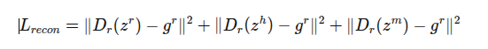

这个 loss 要求：

```
robot token 解码后 ≈ robot motion
human token 解码后 ≈ robot motion
hybrid token 解码后 ≈ robot motion
```

###### loss_2

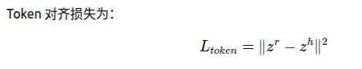

它要求 robot token 和 human token 尽量接近。


###### loss_3

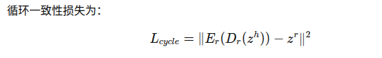


它保证 human motion 转成 robot motion 后，动作语义没有丢失。


##### Trick

**Bin-based Adaptive Motion Sampling**

训练时，每个 episode 都要从某个动作片段的某一帧开始。
 如果完全随机采样，困难动作可能采得太少。
 所以 SONIC 用 adaptive sampling 增加困难动作片段的训练机会。


### Generative Kinematic Motion Planner

 **kinematic motion planner** 是一个高层动作生成器。它不是直接输出电机力矩，也不是直接控制机器人关节，而是生成一段 **机器人可跟踪的运动参考轨迹**。


#### Motion Representation

训练时，模型看到的是一段短动作：

上下文关键帧─── 中间动作 ─── 目标关键帧

推理的时候：

给定起点和终点，**生成中间自然动作**

生成的动作配置和 tracking policy 所需要的动作格式是一致


# MOSAIC


核心创新

它不是直接把原来的 general tracker 拿去 fine-tune，因为那样可能会破坏原来的通用能力。
 而是：

```
general tracker 输出动作
        +
residual adaptor 输出补偿量
        =
最终动作
```

也就是让一个小模块专门学习“这个接口带来的偏差应该怎么修正”。


```
python3 -m py_compile Visualize_6keypoints.py
python3 Visualize_6keypoints.py --ann reduced_6kp/train/body/annotation/0a6720a4-e840-4e60-9e7b-77a0743d5e32.json --save outputs/visualize_6kp_smoke.gif --fps 6
```


## yibo


### command生成理解

基本流程

```
初始化：
    给每个 env 分配 motion index 和 motion group

reset：
    给 reset 的 env 选择 motion 中的某一帧
    从该帧读取 root/joint 状态
    加随机扰动
    写入仿真器

每个 step：
    reference time_steps 加 1
    检查 motion 是否结束
    更新相对身体状态缓存
    更新失败统计

生成 obs 时：
    从当前 time_steps 开始读取未来 horizon 帧 reference joint_pos/joint_vel
    拼成 command
    command 进入 policy/teacher/critic/ref_vel_estimator obs
```


### NPZ提供

- npz 直接写进 policy/teacher 主观测向量的 reference 信息主要是：
  - `command`：参考 `joint_pos` + `joint_vel`
  - `motion_anchor_ori_b`：参考锚点姿态（来自 npz 的 `body_quat_w`，经 anchor body 索引）
  - Teacher 还有 `ref_base_lin_vel`（来自 npz 的 `body_lin_vel_w`）
- obs 里名叫 `joint_pos` / `joint_vel` 的那两项是机器人当前状态，不是 npz。
- npz 的 `body_pos_w` 等不会原样进 `body_pos` obs；body 相关 npz 主要经 anchor / reward / 相对位姿缓存 间接使用。

一句话： npz 给网络的 reference 信号主要是 `command`（关节轨迹）+ 锚点姿态/速度相关项


### Obs Teacher 比 Student 多了什么？

对比一下：

| Observation                                          | Student/Policy | Teacher    |
| ---------------------------------------------------- | -------------- | ---------- |
| command(参考动作的关节目标)                          | 有             | 有         |
| motion_anchor_ori_b (参考 vs 机器人的 anchor 的方向) | 有             | 有         |
| motion_anchor_pos_b （参考提供，位置）               | 无             | 有         |
| body_pos                                             | 无             | 有         |
| body_ori                                             | 无             | 有         |
| base_lin_vel                                         | 无             | 有         |
| ref_base_lin_vel                                     | 无             | 有         |
| base_ang_vel                                         | 有             | 有         |
| joint_pos                                            | 有             | 有         |
| joint_vel                                            | 有             | 有         |
| last_action                                          | 有             | 有         |
| noise                                                | 有             | 无         |
| history                                              | 5              | 默认当前帧 |

这说明：

```
Teacher 看到的信息更全、更干净。
Student 看到的信息更少、更接近部署场景。
```

这就是典型的：

```
privileged teacher → deployable student
```

# BeyondMimic

**BeyondMimic = 强大的低层动作跟踪器 + 可组合的高层扩散动作生成器。**

它从“让机器人模仿人类动作”进一步走向“让机器人基于人类动作库灵活生成和组合动作”，这是从 **motion tracking** 到 **versatile humanoid control** 的关键转变。


为了提高多功能性，以往工作主要采用了两条路线。

第一条路线是分层控制，它将任务无关的动作跟踪器与任务层面的运动规划器结合起来。

但是会出现：**planner-controller mismatch** 很关键。
 意思是高层规划器给出的动作，低层控制器未必能自然、稳定地执行。


第二条路线使用多任务生成模型直接学习动作分布。

**解释：**
 这类方法不再简单地分成 planner 和 tracker，而是希望模型直接学习：

```
在不同任务条件下，人类式动作应该长什么样
```


BeyondMimic is built on two key insights

Insight 1：用更简洁的 motion tracking，而不是复杂 RL 堆料


 Insight 2：用 diffusion 在推理时组合技能、适应新任务

BeyondMimic 会将强化学习训练得到的原子技能合成为新的动作序列，以便在测试时实现零样本的任务特定控制。

扩散模型学习的是数据分布的梯度场，而不是分布本身；这使得它们能够在测试时通过梯度优化朝任意可微目标前进，这种技术被称为 classifier guidance。

**解释：**
 这句话比较关键。

可以这样理解：

普通生成模型学的是：

```
哪些动作像人类动作
```

扩散模型更像学到了：

```
如果当前动作不像人类动作，应该往哪个方向修正，才能更像人类动作
```


# WBC 


## Egoexo4D 数据处理

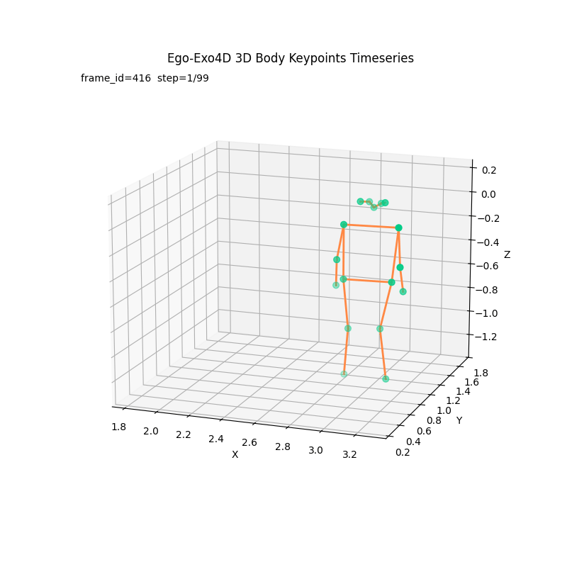


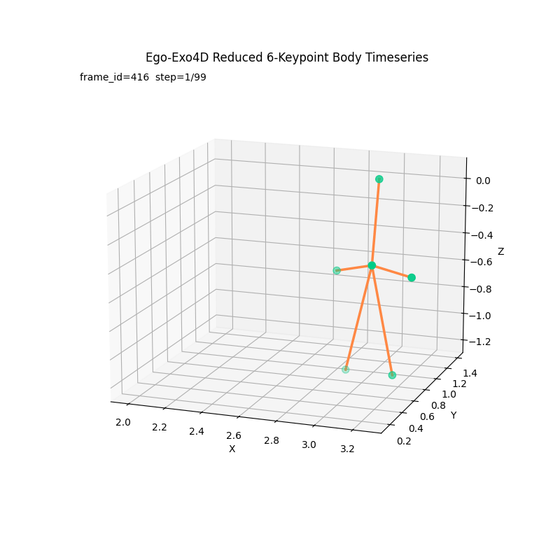

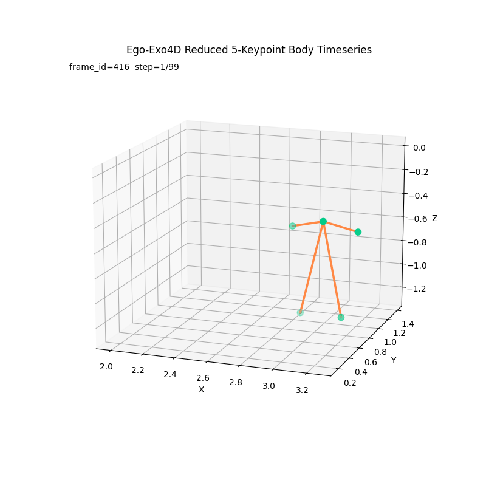

### 数据格式


```bash
419": [
    {
      "annotation3D": {
        "left-wrist": {
          "x": 2.787237103418844,
          "y": 0.9184678748292,
          "z": -0.5321478206820871,
          "num_views_for_3d": 4
        },
        "right-wrist": {
          "x": 3.194282909450167,
          "y": 0.9236894593328208,
          "z": -0.5613970018822859,
          "num_views_for_3d": 3
        },
        "left-ankle": {
          "x": 2.888646545021359,
          "y": 0.8466188573975031,
          "z": -1.2177207928243423,
          "num_views_for_3d": 4
        },
        "right-ankle": {
          "x": 3.131946903892881,
          "y": 0.838100786487857,
          "z": -1.2246498662184624,
          "num_views_for_3d": 4
        },
        "pelvis-mid": {
          "x": 2.9839158686774048,
          "y": 0.8586949924857195,
          "z": -0.46714803920861386,
          "num_views_for_3d": 4
        }
      }
    
```


## Mosaic 数据处理

#### 原始数据

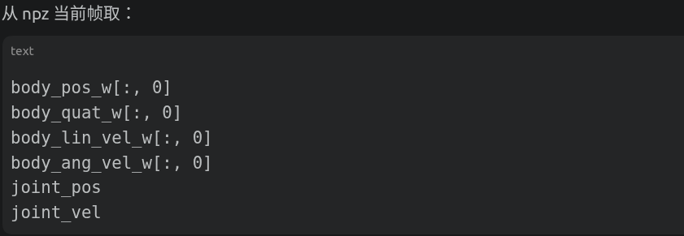

#### Teacher 模型的训练中坐标转换

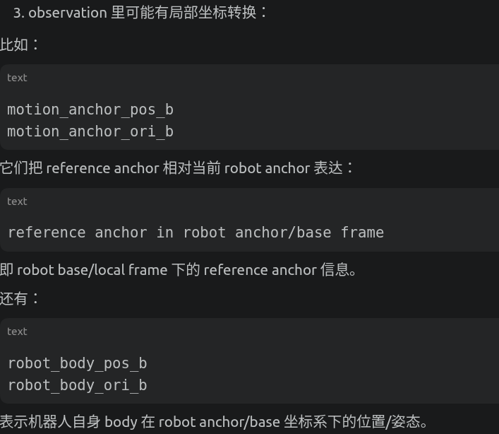

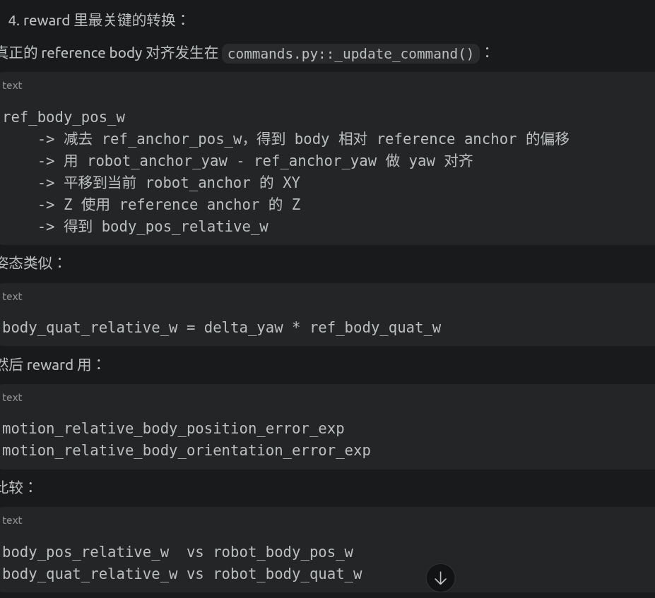


## 5 KP_pose映射到29dof的joint (思路二) （66条npz）

### 训练

```bash
python scripts/train_flow_policy.py \
  --data_dir dex_evt_npz_5kp \
  --out_dir flow_policy_runs/tcn_flow_new \
  --history 32 \
  --batch_size 512 \
  --epochs 100 \
  --device cuda
```

### 推理

```
python scripts/infer_flow_policy.py \
  --input dex_evt_npz_5kp/dex_evt_lafan1_walk4_subject1_5kp_frames.npz \
  --run_dir flow_policy_runs/tcn_flow_new \
  --output flow_policy_runs/tcn_flow_new/dex_evt_lafan1_walk4_subject1_flow_pred.npz \
  --device cuda \
  --flow_steps 20
```


#### 数据处理

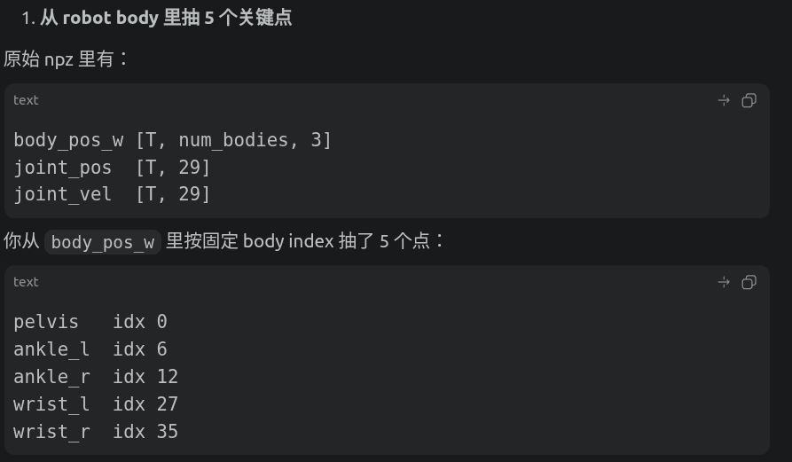

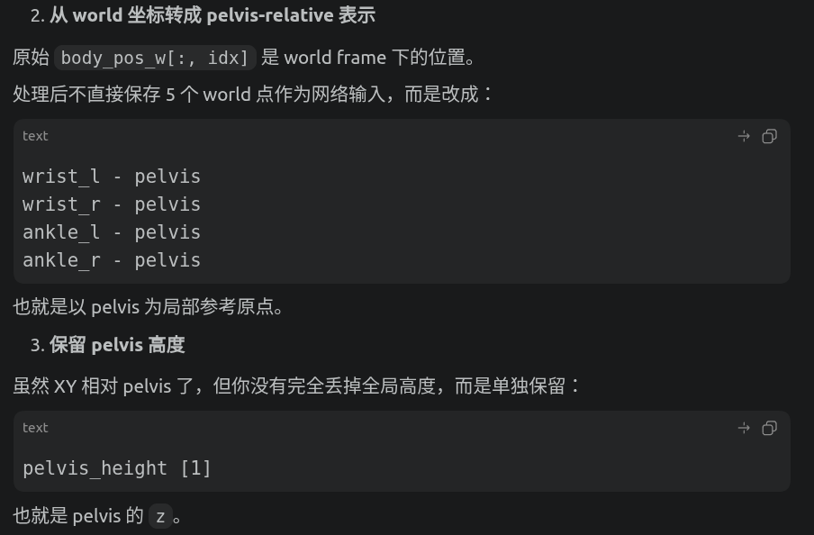

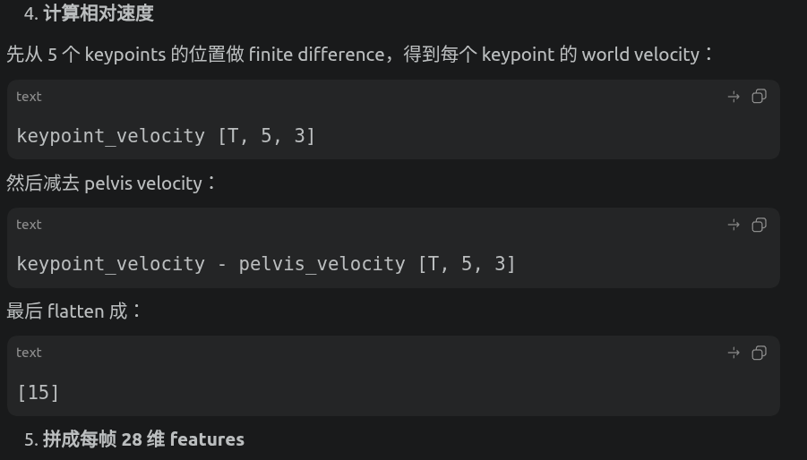

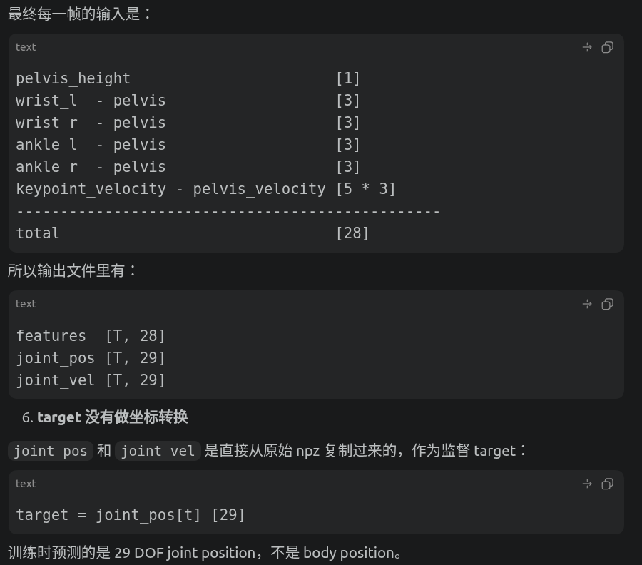


#### 训练流程总结

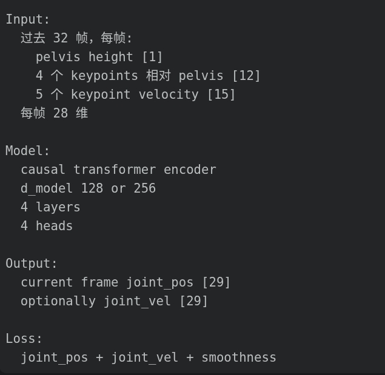


### Flow policy

#### 训练阶段的数据流

```


npz 文件
    ├── features:  [T, 28]
    └── joint_pos: [T, 29]
            ↓
FiveKpFramesDataset
            ↓
切片一个样本：
    history = features[t-H+1:t+1]  [H, 28]
    target  = joint_pos[t]         [29]
            ↓
DataLoader batch
    history: [B, H, 28]
    target:  [B, 29]
            ↓
归一化
            ↓
Flow Matching 构造训练点：
    x0 = random noise              [B, 29]
    x1 = target                    [B, 29]
    t  = random time               [B]
    x_t = (1-t)x0 + t x1            [B, 29]
    v_target = x1 - x0              [B, 29]
            ↓
TCNConditionEncoder:
    history [B, H, 28]
        ↓
    cond [B, 256]
            ↓
FlowMLP:
    x_t [B, 29] + t_emb [B, 64] + cond [B, 256]
        ↓
    v_pred [B, 29]
            ↓
Loss:
    MSE(v_pred, v_target)
            ↓
反向传播更新 TCN + FlowMLP
```

#### 推理阶段的数据流

推理时没有 `target`，只有历史 keypoint 特征。

```
输入：
    最近 32 帧 features
    history: [1, 32, 28]
            ↓
归一化 feature
            ↓
初始化：
    x = random noise [1, 29]
            ↓
循环 20 次：
    TCN(history) -> cond [1, 256]
    FlowMLP(x, t, cond) -> v [1, 29]
    x = x + dt * v
            ↓
输出：
    pred_norm [1, 29]
            ↓
target_norm.decode()
            ↓
机器人 joint_pos [1, 29]
```

最终输出就是：

```
当前帧机器人 29 个关节的目标角度
```


#### ID 测试集可视化

```
python scripts/replay_flow_pred.py \
  --robot dex_evt \
  --pred_file flow_policy_runs/tcn_flow_smooth_w5/dex_evt_lafan1_walk4_subject1_flow_pred.npz\
  --root_height 0.95 \
  --speed 0.5 \
  --loop
```


<video src="../../Videos/Screencasts/Screencast from 2026年05月28日 18时50分42秒.webm" controls=""></video>


#### 原始GT可视化


```
python scripts/replay_npz.py \
  --robot dex_evt \
  --motion_file dex_evt_npz/dex_evt_lafan1_walk4_subject1.npz \
  --anchor_body pelvis
```


<video src="../../Videos/Screencasts/Screencast from 2026年05月28日 18时56分56秒.webm" controls=""></video>

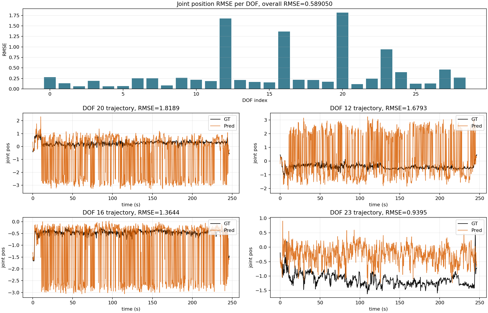

它表示预测值和真实值之间的平均误差大小：

```
RMSE = 0      完全一致，最好 RMSE 越小     预测越接近 GT RMSE 越大     误差越大
```


#### ID训练集可视化

<video src="../../Videos/Screencasts/Screencast from 2026年05月28日 19时04分28秒.webm" controls=""></video>


#### 训练集GT可视化


<video src="../../Videos/Screencasts/Screencast from 2026年05月28日 19时00分55秒.webm" controls=""></video>


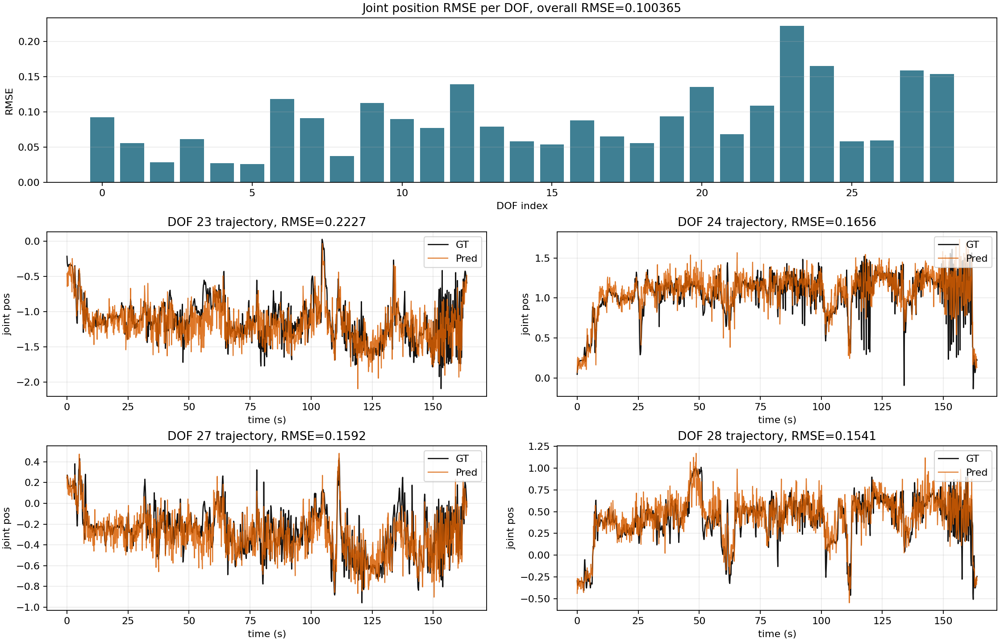


#### 添加动作平滑


<video src="../../Videos/Screencasts/Screencast from 2026年05月29日 14时29分16秒.webm" controls=""></video>


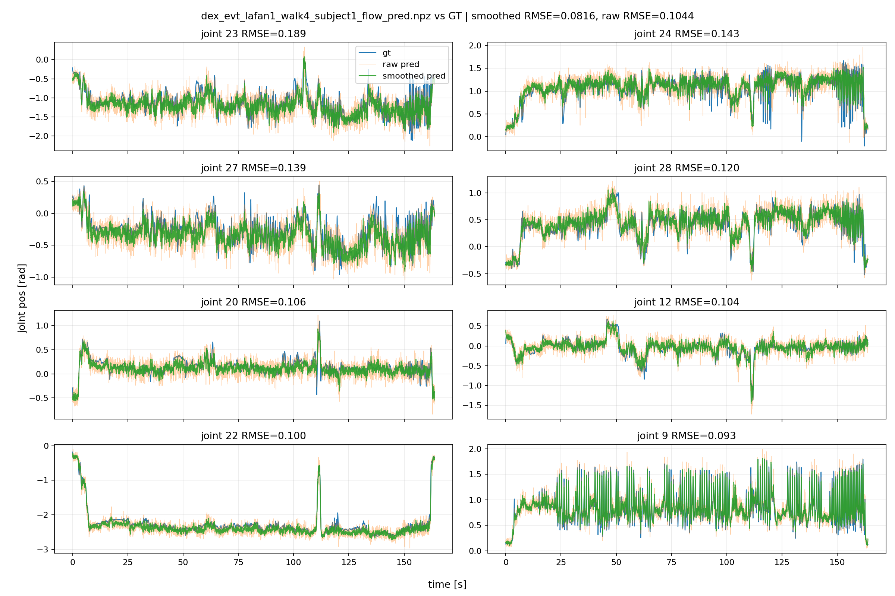


