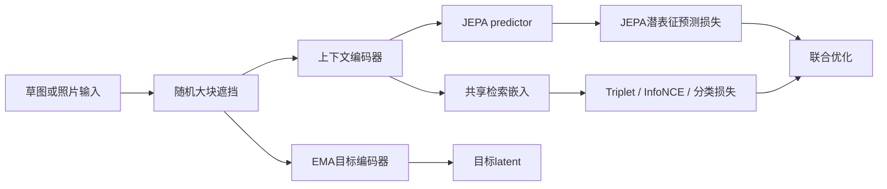
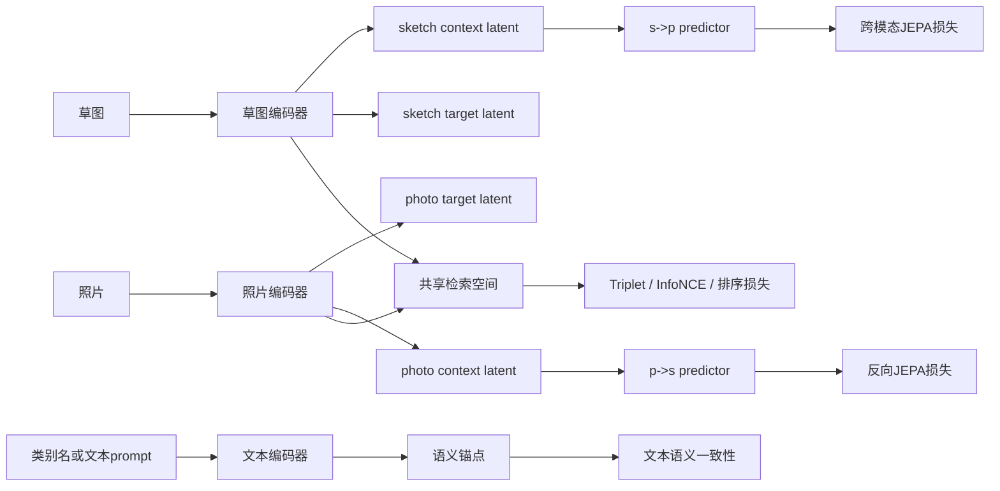
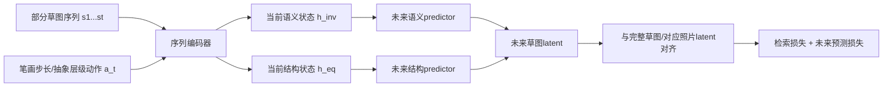
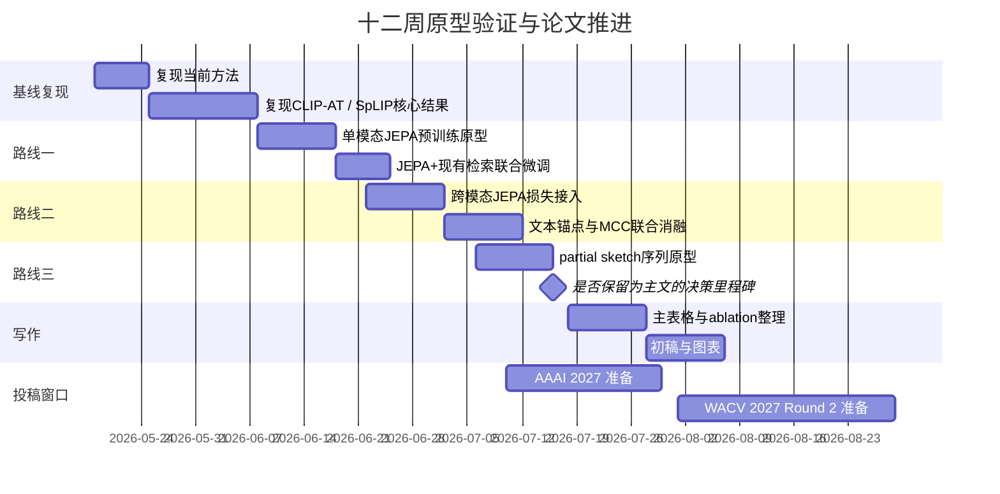

# JEPA 世界模型视角下的 ZS-SBIR 可行路线报告

> 说明：本文档已统一清理非标准引用标记，并将展示公式整理为 Markdown 常用的 `$$ ... $$` 块级公式格式。正式投稿前，建议将参考文献进一步补齐为 BibTeX 或 GB/T 7714 格式。

## 执行摘要

本研究目标可以明确表述为：**把现有零样本草图检索方法 ZS-SBIR，从“跨模态判别检索器”升级为“带有 JEPA 式预测机制的语义世界模型检索器”**，从而在未见类上提升泛化、降低草图—照片模态鸿沟，并增强语义对齐与可解释性。结合近五年的 ZS-SBIR 与 JEPA 路线，核心判断是：**最可行的主线不是从头训练一个大规模视频世界模型，而是把 JEPA 的“潜表征预测”思想嵌入现有双分支检索框架**，先做图像级/跨模态 I-JEPA 化，再决定是否升级到更强的序列世界模型。I-JEPA 的核心优势是直接在潜空间预测被遮挡目标表征，不依赖负样本或像素重建；这类“语义级预测”恰好与草图天生缺纹理、重结构、重语义的特性匹配。

从落地性、论文新意与算力风险三方面综合排序，建议优先采用三层推进路线：**第一层**做“JEPA 预训练 + 现有 ZS-SBIR 微调”，这是最低风险、高 ROI 的路线；**第二层**做“跨模态 JEPA 预测损失”，把 sketch→photo / photo→sketch 的潜表征预测直接并入检索训练，这是最有论文 novelty 的主线；**第三层**再尝试“草图绘制过程/渐进抽象”的序列世界模型，把部分草图、笔画序列或抽象层级视为状态序列，用 seq-JEPA 风格建模未来潜状态，这一路线最贴近“世界模型”叙事，但风险也最高。

同时，需要非常明确地**不建议**从零开始训练类似 V-JEPA 2 的大模型。V-JEPA 2 的官方路线依赖超过 100 万小时互联网视频预训练，并在后续用机器人轨迹数据做动作条件世界模型后训练；这对一篇从 ZS-SBIR 迁移过来的论文既不现实，也没有必要。对于该研究而言，更合理的策略是：**复用公开 I-JEPA / V-JEPA 设计与权重，借鉴其目标函数和 predictor 结构，而不是复刻其数据规模**。

最务实的结论是：**先以 CLIP-AT / SpLIP / MCC 为强基线，加入“模态内 I-JEPA 预训练 + 模态间 JEPA latent prediction + 文本语义锚点”，优先完成在 Sketchy-Ext split 2 与 TU-Berlin-Ext 上的实验验证；若 mAP@200 或 mAP@all 能稳定超过现有强基线 1.5–3 个点，再将“世界模型”叙事扩展到 partial sketch / stroke sequence。** 这条路线最像一篇能投出去、也能写清楚的论文。

## 任务定义与假设

### 任务与目标的明确陈述

本研究拟解决的问题是：**在未见类别上，用手绘草图检索照片**。但与传统 ZS-SBIR 只强调跨模态对齐不同，本文希望把方法朝 JEPA 世界模型方向推进：让模型不仅“对齐”，还能够**在潜空间预测缺失语义、建模抽象结构演化，并形成更稳健的 unseen-class representation**。这意味着目标函数会从单纯的 retrieval / classification / triplet，扩大到 **context → target latent prediction**，并可能进一步扩展成 **partial sketch → future latent** 或 **sketch/photo ↔ text latent** 的多目标学习。I-JEPA 与 V-JEPA 的官方叙述都强调，JEPA 学的是语义级表征预测，而不是像素补全；这正是最应借鉴的思想。

### 未指定信息与本报告采用的假设

下列关键信息在当前阶段**尚未明确**，本报告据此采用常见设置给出可执行方案：

| 项目 | 当前状态 | 本报告采用的假设 |
|---|---|---|
| 当前 ZS-SBIR 具体架构 | **未指定** | 假设为双分支或共享主干的 sketch/photo encoder，含 triplet、分类、语义对齐或 prompt 模块 |
| 主干网络 | **未指定** | 优先假设为 CLIP ViT-B/32、CLIP ViT-B/16 或 DINO/ConvNeXt 级别骨干 |
| 数据集 | **未指定** | 先按 Sketchy-Ext split 2、TU-Berlin-Ext、QuickDraw-Ext、Sketchy FG 设计实验 |
| 文本语义监督 | **未指定** | 假设可用类别名、prompt、WordNet 或 CLIP text embedding |
| 代码基础 | **未指定** | 假设已有可训练基线代码，可插入新 loss/head，而不是从头重写 |
| 算力预算 | **未指定** | 优先按 1–4 张 24GB–80GB GPU 的学术常见条件规划 |

如果现有方法已经包含 prompt learning、teacher-student distillation、局部对齐或多头检索，那么报告中的路线 A/B 依然适用，只是插入点会不同：**A 偏向训练范式替换，B 偏向损失与预测头替换，C 偏向数据表示与任务定义升级。**

## ZS-SBIR 与 JEPA 的体系对比与映射

### 核心差异与对接思路

传统 ZS-SBIR 主线，尤其是最近两年强方法，主要围绕三类信号展开：**跨模态检索损失**、**基于文本/类别名的语义约束**、**对草图局部结构或 prompt 的适配**。例如 CLIP-AT 通过 CLIP + sketch-specific prompt 提升类别级和细粒度设置；MA-ZS-SBIR 通过文本中介间接对齐 sketch/photo，并显式分离 modality-agnostic 与 modality-specific 成分；MCC 则从总体分布统计出发，用 modality capacity loss 约束类间相似性。

JEPA 路线则不同。它原生不是“检索器”，而是“**在潜空间预测目标表征的非生成式表征学习器**”。I-JEPA 通过从上下文块预测同图像中目标块的表征，学习高语义、可扩展的视觉表示；V-JEPA 把这个思想扩展到视频，进一步强调 motion / planning / world understanding；seq-JEPA 甚至把 invariant / equivariant 表征分开学，说明 JEPA 很适合拿来做“语义—结构”分解。

### 详细对比与映射表

| 维度 | ZS-SBIR 常见做法 | JEPA 常见做法 | 对本研究的映射建议 |
|---|---|---|---|
| 任务目标 | 用 sketch 检索 unseen 类 photo；核心是跨模态对齐与零样本泛化。强方法常用 triplet、InfoNCE/分类、prompt、局部匹配。 | 从 context 预测 target 的**潜表征**；原生目标是学语义表示，而不是直接检索。I-JEPA 与 V-JEPA 都强调 feature prediction 而非 reconstruction。 | 把 JEPA 当作**表征学习层**，不是替代 retrieval 任务本身；检索头保留，训练目标升级为“retrieval + latent prediction”。 |
| 输入/输出 | 输入通常是 sketch/photo；输出是共享嵌入、相似度分数或排序。部分方法再引入 text prompt。 | 输入是 context token 与 target mask；输出是 target latent embedding 的预测。V-JEPA 还可以加 action-conditioned predictor。 | 输入仍然是 sketch/photo，但可再派生 partial sketch、masked patch、edge map、class text；输出新增 predictor 的 latent target。 |
| 核心架构 | 双分支 encoder、共享/非共享 backbone、cross-attn、局部 token 匹配、prompt 或 teacher-student。 | context encoder + EMA target encoder + predictor；视频版可升级成时间预测与动作条件模块。 | 在现有 sketch/photo encoder 上，新增 **EMA target branch + predictor head**；尽量少改 backbone，多改训练范式。 |
| 损失函数 | Triplet、classification / InfoNCE、KL/蒸馏、局部 correspondence、分布约束。MCC 显式控制 modality capacity。 | 主要是 latent regression；JEPA 原生不依赖 negative pairs。部分后续工作加 VICReg 风格正则以稳住表示。 | 保留 retrieval loss，再叠加 \(L_{\text{JEPA}}\)。如果训练不稳，再加 variance/covariance regularization。 |
| 训练范式 | 多为有监督微调或半监督微调，围绕 benchmark 训练 60 epochs 左右；MCC 在 11GB 3080Ti、224 分辨率、batch 64、60 epoch 上可训练。SpLIP 同样使用 60 epoch。 | 自监督预训练 + 下游 probing / finetune；I-JEPA 官方 ViT-H/14 在 16×A100 上 72 小时内完成 ImageNet 训练。 | 更适合采用“两阶段”或“warm-start”训练：先轻量 JEPA 预训练，再用 ZS-SBIR 目标微调。 |
| 对比学习依赖 | CLIP-AT、SpLIP、MCC（CLIP 分支）都仍高度依赖 classification / InfoNCE / triplet。 | JEPA 原生非对比，不需要 hand-crafted negatives；更像预测编码。 | 这正是论文亮点之一：把 ZS-SBIR 从“纯对比式对齐”推进到“预测式语义对齐”。 |
| 表征分解 | MA-ZS-SBIR 显式把语义与模态信息分离；这是与目标最接近的已有 ZS-SBIR 工作。 | seq-JEPA 学 invariant / equivariant 分离表征；MC-JEPA 联合学习 motion 与 content；C-JEPA 引入 object-centric causal bias。 | 可以把“语义 invariant”用于类别检索，把“结构/笔画 equivariant”用于局部重排或细粒度排序。 |
| 数据需求 | benchmark 规模有限，配对 sketch/photo 为主；QuickDraw 可提供海量 sketch，Sketchy/QuickDraw 原始笔画可支持序列化输入。MCC 论文给出 Sketchy / TU-Berlin / QuickDraw 规模。 | 大规模自监督更受益，但不一定要从零做大模型。V-JEPA 2 从头训练需 >100 万小时视频，不现实。 | 可行做法是：**小规模 JEPA 预训练 + 公共权重迁移 + benchmark 微调**，而不是 web-scale 预训练。 |
| 计算成本 | 近年 ZS-SBIR 强基线多可在单机 GPU 或小规模多卡上完成。 | I-JEPA / V-JEPA 从零训练很贵，但 predictor/head 迁移相对便宜。 | 本研究最合理的算力区间是 1–4 GPU；**方案应该围绕 ViT-B/L 级骨干微调，不该围绕 V-JEPA 2 从零训练。** |

### 一个关键判断

从论文定位上说，**本研究不是要“把 ZS-SBIR 改造成视频世界模型”，而是要“把 ZS-SBIR 的表征学习范式改造成 JEPA 风格的潜空间预测学习”**。这会让论文叙事更严谨，也更容易被审稿人接受：  
- 在视觉/多模态审稿人眼里，这是**从对比式检索走向预测式表征学习**；  
- 在世界模型审稿人眼里，这是**把 world-model spirit 迁移到静态跨模态检索**；  
- 在 SBIR 审稿人眼里，这是**缓解 sketch 抽象性与 unseen generalization 的新训练范式**。

## 近五年相关工作与开源实现

### ZS-SBIR 主线工作

| 论文 | 关键贡献 | 数据集 / 指标 | 复现性评估 |
|---|---|---|---|
| **DSN 2021** — Domain-Smoothing Network for Zero-Shot Sketch-Based Image Retrieval 论文页 | 用 cross-modal contrastive + category-specific memory bank 缓解 sketch/photo 域差与草图类内差异，是近五年较早把“分布平滑”做系统的工作。 | SpLIP 汇总表中，Sketchy-1 mAP@all/P@100 为 58.3/70.4，TU-Berlin mAP@all/P@100 为 48.4/59.1。 | **A-**。有官方仓库 DSN repo，含训练/测试脚本，但预训练权重主要通过外部网盘分发。 |
| **TVT 2022** — Three-Way Vision Transformer through Multi-Modal Hypersphere Learning | 用 DINO-ViT / ViT 路线强化多模态 hypersphere 表征，代表了 transformer 化的早期高性能 ZS-SBIR。 | SpLIP 汇总中，Sketchy-1 为 64.8/79.6，Sketchy-2 为 53.1/61.8，TU-Berlin 为 48.4/66.2。 | **B**。本次检索未见明确官方仓库；适合作为引用基线，不宜做首个复现实验。 |
| **CLIP-AT 2023** — CLIP for All Things Zero-Shot Sketch-Based Image Retrieval, Fine-Grained or Not 项目页 | 首次系统性把 CLIP + prompt learning 推到 ZS/GZS/FG-ZS-SBIR，多处结果比旧方法提升 24.8%/26.9% 量级，是当前最应继承的“性能稳定”基线。 | SpLIP 汇总中，Sketchy-2 mAP@200/P@200 为 72.3/72.5，TU-Berlin mAP@all/P@100 为 65.1/73.2，QuickDraw mAP@all/P@200 为 20.2/38.8；FG-ZS Acc@1/Acc@5 为 28.68/62.34。 | **A**。官方仓库 Sketch_LVM 仓库 有可运行命令与代码结构说明。 |
| **ZSE-SBIR 2023** — Zero-Shot Everything Sketch-Based Image Retrieval, and in Explainable Style CVPR 论文 | 把 inter-category、intra-category、cross-dataset 三种设置统一到一个 transformer 局部匹配框架，并突出 explainability；非常适合与“世界模型 + 可解释局部预测”叙事衔接。 | SpLIP 表中，ZSE-Ret 在 Sketchy-1 达 73.6/80.8，在 TU-Berlin 达 56.9/63.7；ZSE-RN 在跨数据集上也有较强基线。 | **A-**。有官方仓库 ZSE-SBIR repo，但框架较复杂，适合做局部匹配模块参考。 |
| **MA-ZS-SBIR 2024** — Modality-Aware Representation Learning for Zero-shot Sketch-based Image Retrieval WACV 论文 | 通过 text 间接对齐 sketch/photo，并显式 disentangle modality-agnostic 与 modality-specific 信息；是与“表征分解”目标最直接对应的工作。 | SpLIP 表中，MARL 在 Sketchy-2 为 69.1/75.5，在 TU-Berlin 为 70.5/77.7，在 QuickDraw 为 32.7/42.5；FG-ZS Acc@1/Acc@5 为 29.96/58.53。 | **A**。有官方仓库与预训练权重说明：MA-ZS-SBIR repo。 |
| **MCC 2024** — Zero-Shot Sketch Based Image Retrieval via Modality Capacity Guidance IJCAI 论文 | 从 modality population distribution 出发，提出 modality capacity constraint loss；最大的价值在于它几乎不改 backbone，只改 loss，就能提升 generalization。 | 在 Sketchy split 2 上，CLIP-ViT + \(L_{cls}+L_{mcc}\) 达 0.782/0.747，CLIP-ViT + \(L_{tri}+L_{mcc}\) 达 0.790/0.757，DINO-ViT + \(L_{tri}+L_{mcc}\) 达 0.805/0.768。 | **A**。论文提供代码地址，且实现设置清楚：224 分辨率、60 epoch、batch 64、11GB RTX 3080Ti。代码链接见 [ZS-SBIR-MCC repo](https://github.com/YHdian0716/ZS-SBIR-MCC.git)。 |
| **SpLIP 2024** — Elevating All Zero-Shot Sketch-Based Image Retrieval Through Multimodal Prompt Learning ECCV 论文 | 用 frozen CLIP backbone + 多模态 prompt + conditional cross-modal jigsaw，在 ZS/GZS/FG-ZS 三种设置上都很强，是当前最现实的 SOTA 级工程起点。 | Sketchy-1 为 80.2/86.7，Sketchy-2 为 76.4/77.3，TU-Berlin 为 73.1/78.2，QuickDraw 为 34.2/44.6；GZS Sketchy-2 为 68.2/74.5；FG-ZS 为 33.45/66.71。 | **A**。官方仓库 SpLIP repo；非常适合作为本文方法的直接比较对象。 |

### JEPA 与世界模型主线工作

| 论文 | 关键贡献 | 与本研究的相关性 | 复现性评估 |
|---|---|---|---|
| **A Path Towards Autonomous Machine Intelligence 2022** OpenReview 版本 | Yann LeCun 在 Meta AI 提出 H-JEPA、predictive world model、hierarchical planning 的纲领性框架。 | 这是“为什么要把检索器变成预测器”的理论总纲。 | **C**。理论性强，不是直接可复现代码。 |
| **I-JEPA 2023** — Self-Supervised Learning from Images with a Joint-Embedding Predictive Architecture Meta 论文页 | 图像级 JEPA 的标准范式：上下文块预测目标块 latent，强调 semantic features、非生成、无 negatives。 | **最直接可迁移**到静态 sketch/photo 场景。 | **A**。官方代码与 checkpoint 完整：ijepa repo。 |
| **V-JEPA 2024** — Revisiting Feature Prediction for Learning Visual Representations from Video Meta 论文页 | 把 JEPA 扩到视频，强调 motion understanding、无 text / 无 negatives / 无 reconstruction。 | 为“世界模型叙事”提供视频版证据，但不建议从零复训。 | **A-**。官方代码：V-JEPA repo。 |
| **seq-JEPA 2025** — Autoregressive Predictive Learning of Invariant-Equivariant World Models NeurIPS / OpenReview 页面 | 通过顺序预测显式学习 invariant / equivariant 两类表征，非常适合将“语义类信息”和“笔画/结构细节”分开。 | 是构建“partial sketch / stroke sequence world model”最好的直接模板。 | **A-**。有代码和模型：seq-jepa repo。 |
| **V-JEPA 2 2025** — Self-Supervised Video Models Enable Understanding, Prediction and Planning Meta 论文页 | 把 JEPA 明确推到 understanding / prediction / planning，并加入小规模机器人后训练。官方博客明言 world model 和 zero-shot planning。 | 用于支撑“世界模型”定位，但不作为从零实现目标。 | **A**。官方代码与模型：vjepa2 repo。 |
| **C-JEPA 2026** — Causal-JEPA / object-centric world model 项目仓库 | object-level masking 引入 interaction reasoning 与 causal inductive bias，适合启发“部件级 sketch-object token world model”。 | 高风险高上限，适合作为扩展方向，不适合作为第一版主线。 | **B**。有项目仓库，但生态尚新。 |

### 优先阅读与优先复现顺序

| 优先级 | 建议对象 | 为什么先做 | 建议动作 |
|---|---|---|---|
| P0 | 现有方法 | 先建立真实起点与误差来源 | 记录 backbone、loss、split、耗时、最差类别 |
| P1 | Sketch_LVM 仓库 | CLIP 基线扎实，最容易插入 JEPA 头 | 先完整复现 categorical ZS-SBIR |
| P1 | SpLIP repo | 目前最强、最接近多模态对齐前沿 | 复现其 Sketchy-2 与 TU-Berlin 核心结果 |
| P1 | [ZS-SBIR-MCC repo](https://github.com/YHdian0716/ZS-SBIR-MCC.git) | 低改动 loss 即有提升，容易与现有代码融合 | 先复现 \(L_{mcc}\) 作为低成本增强基线 |
| P2 | ijepa repo | 学 predictor、EMA target、masking 策略 | 先在 photo-only 或 sketch-only 上做轻量预训练 |
| P2 | MA-ZS-SBIR repo | 为 disentanglement 与 text bridge 提供现成参照 | 复现 text-bridge 与 modality split 思路 |
| P3 | seq-jepa repo | 为 world-model 版本提供序列模板 | 仅在 partial sketch 原型阶段接入 |
| P3 | vjepa2 repo | 学 world-model 叙事与 planning 结构 | 借鉴，不从零训练 |

## 三条融合路线

### 路线一：JEPA 作为预训练器，再微调到 ZS-SBIR

这是**最稳、最容易做出正结果**的一条线。核心思想是：保留当前 ZS-SBIR 主干，将 sketch encoder 和 photo encoder 先做一个轻量的 I-JEPA 式预训练，让网络先学会“从上下文预测缺失语义”，再用现有 retrieval 目标微调。I-JEPA 已经表明这类 latent prediction 可以学到高语义表征，而且不依赖手工 view augmentation，这对草图这种纹理极弱的模态尤其有利。

**关键模块**  
1. 现有 sketch/photo backbone；  
2. JEPA predictor 头；  
3. EMA target encoder；  
4. 检索 head；  
5. 可选 text semantic head。  

**建议损失**  

$$
L = L_{\text{ret}} + \lambda_s L_{\text{JEPA}}^{(s)} + \lambda_p L_{\text{JEPA}}^{(p)} + \lambda_t L_{\text{text}}
$$

其中  

$$
L_{\text{JEPA}}^{(m)} = \mathbb{E}\left[\|q_\phi(z^{(m)}_{\text{ctx}}, M)-\text{sg}(z^{(m)}_{\text{tgt}})\|_2^2 \right], \quad m\in \{s,p\}
$$

若现有方法已经有 triplet / InfoNCE，则  

$$
L_{\text{ret}} = L_{\text{tri}} \ \text{or}\ L_{\text{cls/InfoNCE}}
$$

**训练步骤**  
第一步，单模态预训练：分别在 sketch 与 photo 上做大块 mask 的 latent prediction。  
第二步，共享空间对齐：用现有 ZS-SBIR retrieval 目标联合微调。  
第三步，可选蒸馏：把 text embedding 或 class prompt 作为语义锚。  

**预期优点**  
它几乎不改变现有推理图，只改变训练过程；因此 engineering 风险最小。它还容易解释：JEPA 强化了对“被遮挡语义区域”的预测能力，相当于逼迫模型在 sketch 中学习更加抽象的可迁移结构。

**预期缺点**  
这条路线的“world model 特征”还不够强，更像 JEPA-style SSL for retrieval，而不是严格的 action-conditioned world model。审稿人可能会问：这是不是只是又一个自监督预训练？因此论文写作时要把“semantic latent prediction”写成核心，而不是把它简单包装成预训练技巧。  

**数据与算力估算**  
就原型而言，无需 ImageNet 级重训 I-JEPA。I-JEPA 官方大模型是 16×A100、72 小时内完成；但 MCC 与 SpLIP 都表明 ZS-SBIR 强基线在 224 分辨率、60 epoch、单机或小规模多卡即可跑通。基于此，若采用 ViT-B/16 或 ViT-B/32，冻结大部分 backbone，仅训练 predictor、LayerNorm 和少量 adapter，原型成本大致可控制在 **1–2 张 24GB GPU，1–3 天**；完整消融则建议 **2–4 张 GPU，3–5 天**。这是结合官方训练规模与近年 ZS-SBIR 实验设置给出的工程估算。

**主要风险与缓解**  

| 风险 | 表现 | 缓解策略 |
|---|---|---|
| predictor 学不到有用信号 | JEPA loss 下降但 retrieval 不涨 | 提高 target 块尺度，减少过小 mask；I-JEPA 官方就强调大语义块很关键。 |
| sketch 分支 collapse | 草图模态太稀疏，latent prediction 过易 | 对 sketch 使用更大 target block、更多结构增强、可加 variance regularization |
| 预训练收益被已有 CLIP 吸收 | CLIP backbone 本来已很强 | 只对 sketch branch 做 JEPA、photo branch 少调，突出“草图语义补全”这一差异化点 |

### 路线二：在 ZS-SBIR 中直接加入跨模态 JEPA 预测损失

这是**我最推荐的论文主线**。原因是它不只是“先预训练再微调”，而是让模型在训练时直接学习：**给定 sketch 的上下文表示，预测匹配 photo 的目标 latent；给定 photo 的上下文表示，预测对应 sketch 的目标 latent**。它把“跨模态对齐”从纯相似度约束升级为“可预测性约束”，最贴近 JEPA 的精神，也最容易写出新意。

**关键模块**  
1. sketch/photo 双编码器；  
2. 两个跨模态 predictor：\(q_{s\to p}\)、\(q_{p\to s}\)；  
3. text prompt 或类别名语义锚点；  
4. 可选的 variance/covariance regularizer。  

**建议损失**  

$$
L = L_{\text{ret}} + \lambda_{sp} L_{s\to p}^{\text{JEPA}} + \lambda_{ps} L_{p\to s}^{\text{JEPA}} + \lambda_{\text{txt}} L_{\text{txt}} + \lambda_{\text{reg}} L_{\text{reg}}
$$

其中  

$$
L_{s\to p}^{\text{JEPA}} = \|q_{s\to p}(z_s^{\text{ctx}}) - \text{sg}(z_p^{\text{tgt}})\|_2^2
$$

$$
L_{p\to s}^{\text{JEPA}} = \|q_{p\to s}(z_p^{\text{ctx}}) - \text{sg}(z_s^{\text{tgt}})\|_2^2
$$

文本锚点可写成  

$$
L_{\text{txt}} = \|W_s z_s - t_y\|_2^2 + \|W_p z_p - t_y\|_2^2
$$

其中 \(t_y\) 为类别名或 prompt 的文本表征。这个设计与 MA-ZS-SBIR 的“通过文本间接对齐 sketch/photo”思路是兼容的，但本文将对齐方式从 contrastive 进一步推进到了 predictive。

**训练步骤**  
第一阶段，初始化：用 CLIP-AT 或 SpLIP 的 backbone / prompt 方案热启动。  
第二阶段，加入跨模态 JEPA：先打开 \(s\to p\) 单向，再打开 \(p\to s\) 双向。  
第三阶段，平衡损失：根据 GZS 和 cross-dataset 验证集表现调 \(\lambda\)。  
第四阶段，可选地加入 MCC 的 \(L_{mcc}\)，让类间总体分布更稳。

**预期优点**  
它对 unseen generalization 最有可能带来**实质提升**。因为很多 ZS-SBIR 方法虽然最终相似度空间里对齐了，但并没有要求 sketch latent 对 photo latent“可预测”。一旦可预测性成立，模型更容易学到类别级、结构级的稳定对应。甚至可以把这个框架解释为“在世界模型意义上，照片是草图的一个可观测实现，草图是照片的抽象投影”。  

**预期缺点**  
训练会比路线一更敏感。跨模态 predictor 如果过强，容易学 shortcut；过弱，又学不到 bridging。审稿时也可能被质疑“这是不是 cross-modal distillation 的变体”。解决办法是明确区分：本文的 target 不是 teacher logits，而是 **masked / context-conditioned latent prediction**。  

**数据与算力估算**  
这条路线最适合使用现有 benchmark 的成对 sketch/photo + 类别文本，不要求额外标注。原型建议从 Sketchy-Ext split 2 开始，仅在 CLIP backbone 上训练 predictor、prompt 和少量 adapter。计算量会高于路线一，但一般仍可控制在 **2 张 24GB GPU，2–4 天**。如果再叠加 GZS、cross-dataset 与 FG-ZS 消融，建议 **4 张 GPU，约 1 周**。这一估计是按 SpLIP / MCC 的 224–224 或 CLIP ViT-B 级设定外推得出。

**主要风险与缓解**  

| 风险 | 表现 | 缓解策略 |
|---|---|---|
| 双向预测互相牵制 | 一个方向提升，另一个方向下降 | 先做单向 \(s\to p\)，收敛后再加反向 |
| 与 triplet / InfoNCE 冲突 | 排序指标波动大 | 分阶段训练：先 retrieval，后加 JEPA；或余弦退火调 \(\lambda_{sp},\lambda_{ps}\) |
| 学到模态 shortcut | predictor 只记纹理或背景 | 接入文本锚点、edge map、局部 mask，避免纯全局 shortcut |

### 路线三：把草图绘制过程变成序列世界模型

这是**最接近“JEPA 世界模型”原意**的一条路线。思路是把草图不是看成一个静态图，而是看成一个**逐步生成的观测序列**。如果能够获得 QuickDraw 或 Sketchy 的笔画顺序，或者人工构造 partial sketch curriculum，那么就可以把“前几笔 / 前几个 patch”当成 context，把“未来笔画对应的 latent”作为 target，做一个 seq-JEPA 式模型。seq-JEPA 已经证明，顺序预测可以同时学 invariant 与 equivariant 表征；这与同时兼顾“类别语义”和“草图结构细节”的任务高度契合。

**关键模块**  
1. 序列化 sketch 输入：真实 stroke order 或人工构造 partial sketch；  
2. 动作变量 \(a_t\)：下一笔、下一层抽象、下一块可见区域；  
3. invariant semantic state \(h_{\text{inv}}\)；  
4. equivariant structural state \(h_{\text{eq}}\)；  
5. 最终与 photo latent 的对齐头。  

**建议损失**  

$$
L = L_{\text{ret}} + \lambda_f L_{\text{future}} + \lambda_{\text{inv}} L_{\text{inv}} + \lambda_{\text{eq}} L_{\text{eq}}
$$

其中  

$$
L_{\text{future}} = \sum_t \|q(h_t, a_t) - \text{sg}(z_{t+1})\|_2^2
$$

如果显式分离语义与结构，可加  

$$
L_{\text{inv}} = \|h_{\text{inv}} - t_y\|_2^2
$$

$$
L_{\text{eq}} = \|g(h_{\text{eq}}, a_t) - z_{t+1}^{\text{local}}\|_2^2
$$

最终检索使用  

$$
z_{\text{query}} = \left[h_{\text{inv}};\ \alpha h_{\text{eq}}\right]
$$

与 photo embedding 比较。  

**训练步骤**  
第一步，先不用真实 stroke，只用“逐步 reveal”的 partial sketch 人工序列做 concept 验证。  
第二步，如果有效，再换成真实笔画顺序。  
第三步，把最终时刻 latent 与 photo/text latent 对齐。  
第四步，仅在验证集上判断这条线是否值得写入主论文；若不稳定，就降级为补充实验。  

**预期优点**  
如果这条路线取得稳定结果，会给论文带来最强的 world-model 叙事：模型不是只会做最终匹配，而是能**随着草图逐步成形，在线预测语义如何收敛**。这比单纯加一个 loss 更像真正的“草图世界模型”。  

**预期缺点**  
风险最高。它依赖序列数据质量、partial sketch curriculum 设计，以及一个新的评估故事。若主指标提升不大，反而会削弱整篇论文的主线。  

**数据与算力估算**  
最合理的数据源是 QuickDraw 的原始笔画序列，或者从 Sketchy/QuickDraw raster 图像人工构造 4–8 步 reveal curriculum。由于要做序列建模，显存和时间都会上升。小原型建议控制为 **T=4 或 5 步、batch 32–64、分辨率 224**，在 **2–4 张 24GB GPU，约 4–7 天** 内可验证方向。若要上真实笔画与更多序列长度，成本会再涨。

**主要风险与缓解**  

| 风险 | 表现 | 缓解策略 |
|---|---|---|
| 笔画序列噪声大 | future loss 下降慢，检索收益弱 | 先用 reveal curriculum，后上真实 stroke |
| 结构分支吞掉语义分支 | FG 指标提升但 ZS/GZS 指标下降 | 让 \(h_{\text{inv}}\) 直接接 text/class head，确保语义锚定 |
| 论文过于复杂 | 主线不聚焦 | 把该路线定位为“world-model 扩展版”，主论文先以路线二为主 |

### 三条路线的总体排序

| 路线 | 新意 | 工程难度 | 预期收益 | 论文风险 | 建议结论 |
|---|---:|---:|---:|---:|---|
| 路线一 | 中 | 低 | 中 | 低 | **必做**，作为 JEPA 化起点 |
| 路线二 | 高 | 中 | 高 | 中 | **主线首选** |
| 路线三 | 很高 | 高 | 中到很高 | 高 | **做小原型，若结果稳定则纳入主文，否则作为补充实验** |

## 原型实验计划与时间线

### 数据集与评价指标

原型阶段不要贪多，建议按“一个主指标、两个扩展验证”来做。主数据集首选 **Sketchy-Ext split 2**，因为近年强方法几乎都报告了 mAP@200/P@200；扩展验证用 **TU-Berlin-Ext** 看类别泛化，用 **QuickDraw-Ext** 看极端抽象草图。若若希望强化“世界模型”叙事，再加 **Sketchy FG-ZS** 验证细粒度。SpLIP 的报告设置基本可以直接沿用。

评价指标建议统一为：  
- categorical ZS-SBIR：Sketchy-2 用 mAP@200、P@200；TU-Berlin 用 mAP@all、P@100；QuickDraw 用 mAP@all、P@200；  
- GZS-SBIR：Sketchy-2 用 mAP@200、P@200，TU-Berlin 用 mAP@all、P@100；  
- FG-ZS-SBIR：Sketchy 用 Acc@1、Acc@5。

### 基线与对照

| 类别 | 建议基线 | 作用 |
|---|---|---|
| 现有方法 | 现有论文模型 | 真实起点与最公平对比 |
| 强 CLIP 基线 | CLIP-AT、SpLIP | 检验 JEPA 是否还能提升强基础模型 |
| 表征分解基线 | MA-ZS-SBIR | 检验方法是否只是重复 disentanglement 思路 |
| 低改动 loss 基线 | MCC | 检验 JEPA 是否优于简单统计约束 |
| 经典 early baseline | DSN / TVT | 放在表里做历史纵向对比 |

### 超参数建议范围

| 模块 | 建议范围 |
|---|---|
| 输入分辨率 | 224 或 256 |
| JEPA target block 比例 | 0.15 – 0.30 |
| mask 比例 | 0.35 – 0.70 |
| predictor 深度 | 2 – 4 层 MLP / Transformer block |
| latent 维度 | 512 / 768 |
| \(\lambda_{\text{JEPA}}\) | 0.1 / 0.3 / 0.5 / 1.0 |
| \(\lambda_{\text{txt}}\) | 0 / 0.1 / 0.3 |
| EMA decay | 0.996 – 0.999 |
| 解冻策略 | 只训 head；解冻 LN；解冻最后 1–2 个 block |

### 消融实验清单

建议把消融严格分成四组，避免论文显得杂乱：

| 消融组 | 必做问题 | 判定标准 |
|---|---|---|
| JEPA 本体 | 无 JEPA / 单模态 JEPA / 双模态 JEPA | 是否稳定提升主指标 |
| 结构设计 | predictor 深度、EMA on/off、mask 大小 | 是否存在稳定最佳区间 |
| 语义桥接 | no text / class-name / prompt / WordNet | GZS 与 cross-dataset 是否更稳 |
| 世界模型扩展 | static JEPA / partial sketch / stroke sequence | 若收益 < 1 个点或不稳定，则降级为补充 |

### 预期结果与成功标准

建议采用下面这组标准来判断项目是否值得继续扩写成主论文：

| 阶段 | 成功标准 |
|---|---|
| 复现阶段 | 复现强基线达到论文报告值的 95% 左右 |
| 路线一 | 主指标稳定提升 **1.5 个点以上**，且 GZS 不退化明显 |
| 路线二 | 主指标提升 **2–4 个点** 或在 cross-dataset / GZS 上优势更明显 |
| 路线三 | 若主指标提升不足 1 点，但能提供很强的渐进可解释性，也可保留为扩展实验 |

### 时间线

## 工程复用、论文写作与投稿建议

### 可复用的开源代码、权重与工具链

| 优先级 | 资源 | 用法 | 理由 |
|---|---|---|---|
| 高 | Sketch_LVM 仓库 | 作为 CLIP-AT 强基线 | 代码成熟，最适合插入 JEPA predictor |
| 高 | SpLIP repo | 作为最新强基线与多模态 prompt 框架 | 结果强，与 text bridge 高度兼容 |
| 高 | [ZS-SBIR-MCC repo](https://github.com/YHdian0716/ZS-SBIR-MCC.git) | 直接复用 \(L_{mcc}\) | 能低成本增强 generalization |
| 高 | ijepa repo | 参考 EMA target、masking、predictor | 是最直接的 JEPA 模板 |
| 中 | MA-ZS-SBIR repo | 复用文本桥接与 disentangle 设计 | 适合做路线二对照 |
| 中 | ZSE-SBIR repo | 复用局部 token matching/解释性想法 | 若要做部件级 predictor 很有帮助 |
| 中 | seq-jepa repo | 复用序列 predictive skeleton | 用于路线三原型 |
| 低 | vjepa2 repo | 借鉴 world-model/predictor 设计 | 只借设计，不从零训练 |
| 低 | C-JEPA 项目仓库 | 借鉴 object-centric token world model | 适合作为扩展思路 |

工具链上，建议尽量采用“**最少新依赖**”策略：训练框架继续用 [PyTorch](https://pytorch.org)；配置管理可用 [Hydra](https://hydra.cc)；日志可用 [TensorBoard](https://www.tensorflow.org/tensorboard) 或 [Weights & Biases](https://wandb.ai)；近邻检索建议接入 [FAISS](https://faiss.ai)。这样最容易将新方法接入现有代码，而不是被工程重构拖慢。

### 论文贡献点应该怎么写

如果按照“路线二为主、路线一为辅”的结构推进，最稳妥的贡献点写法可以是：

1. **提出一个 JEPA-style 预测式 ZS-SBIR 框架**，把 zero-shot sketch-photo alignment 从对比式约束推进到潜空间预测式约束。  
2. **提出跨模态 latent prediction objective**，实现 sketch→photo 与 photo→sketch 的双向语义可预测对齐。  
3. **引入语义—结构双层表示**，或至少在实验上验证 JEPA 学到的表征更利于 unseen generalization。  
4. **在标准 ZS/GZS/cross-dataset/FG-ZS 评测上系统验证**，并通过 partial sketch 或局部 token 可视化提供更强的解释性。  

如果路线三也部分成功，还可以加一句更强的：  
5. **把草图绘制过程显式建模为序列世界模型**，展示 model 可以随着 sketch 逐步形成而逐步收敛语义预测。  

### 对比实验清单

主表建议最少包含四类对比：  
- 与经典方法：DSN、TVT、ZSE；  
- 与 foundation-model 方法：CLIP-AT、MA、MCC、SpLIP；  
- 与自身退化版本：去掉 JEPA、去掉 text、去掉双向 predictor、去掉 EMA；  
- 与 world-model 相关退化：只做单模态 JEPA、不做跨模态 JEPA、不做 partial sketch。  

图表建议最少包含三类：  
- t-SNE / UMAP：seen vs unseen 的 sketch/photo/text 聚类；  
- partial sketch 检索曲线：随着草图完成度增长，Top-K 命中如何变化；  
- failure case：语义近邻与形状近邻分开讨论。  

### 目标会议与期刊候选

#### 会议候选

| 排序 | 目标 | 匹配度判断 | 时间判断 |
|---|---|---|---|
| 高 | **WACV 2027 Author Guidelines** | 应用 + 算法都接受，与这种“新训练范式 + 标准视觉 benchmark”非常匹配。官方两轮制，Round 1 截止 2026-06-26，Round 2 截止 2026-08-28。 | **最现实** |
| 高 | **AAAI 2027 OpenReview 页面** | 如果将方法升格为“predictive multimodal representation for zero-shot retrieval”，AAAI 也很匹配。页面显示截止 2026-07-28。 | **现实** |
| 中高 | **BMVC 2026 OpenReview 页面** | 视觉方法论文匹配度高，deadline 为 2026-05-30。时间非常紧，更适合已有实验结果的短冲刺。 | **时间紧张** |
| 中高 | **CIKM 2026 Important Dates** | 如果将论文定位到跨模态检索、zero-shot retrieval 和 semantic alignment，CIKM 很有空间。abstract 2026-05-16，full paper 2026-05-23。 | **时间极紧张** |
| 中 | **ECCV 2026 Dates** | 匹配度高，但 2026 主会投稿已经在 3 月截止。 | **当前窗口已过** |
| 中 | **ACM MM 2026 Important Dates** | 多模态匹配很好，但 2026 主会 4 月已截止。 | **当前窗口已过** |
| 中 | **ICCV 2027 / CVPR 2027** | 影响力最高，但截至本次检索未见官方截稿日公告；如果希望冲击更高水平会议，应把路线二打磨成完整版本后准备 2027 周期。 | **中长期目标** |

#### 期刊候选

| 排序 | 目标 | 匹配度判断 |
|---|---|---|
| 高 | TPAMI 主页 | 适合完整版本：理论更完整、消融更全、GZS/FG/cross-dataset 都齐 |
| 高 | IEEE TIP | 更偏视觉表征与图像检索方法，适合方法完整、故事聚焦 |
| 高 | IEEE TMM | 如果强化 sketch/photo/text 的多模态部分，会很匹配 |
| 中高 | Pattern Recognition | 对检索、表示学习、模式识别都友好，且滚动投稿 |
| 中 | Pattern Recognition Letters | 若结果已稳定但故事不够大，可做快速版本 |

### 投稿节奏建议

如果**两个月内**只能形成一个可投稿版本，我建议直接瞄准 **WACV 2027 Round 2** 或 **AAAI 2027**。如果需要把 world-model 叙事写完整、再补齐 partial sketch / cross-dataset / FG-ZS，建议准备 **ICCV 2027 / CVPR 2027 + 后续 TPAMI/TIP 扩展版**。当前时间点不适合再追已经过线的 ECCV 2026 或 ACM MM 2026。

### 开放问题与局限

有三点是本报告尚无法最终确定的。  
第一，当前 ZS-SBIR 方法的 backbone、loss、代码组织方式**未指定**，这会直接决定路线一和路线二的插入难度。  
第二，是否能够获得**真实笔画顺序**尚未说明，因此路线三目前只能先按“partial sketch 人工序列”设计。  
第三，算力预算**未指定**；如果只有单卡 24GB，那么路线二仍可做，但路线三必须强烈收缩。  

因此，真正开始实现前，应先完成一次简短的工程审计：**当前 backbone 是什么、哪些层可冻住、当前主损失是哪一个、是否已有 prompt/text 分支、有没有笔画序列数据。** 这四个问题一旦明确，路线图会更精确。

## 建议优先阅读的十篇关键参考文献

1. A Path Towards Autonomous Machine Intelligence — Yann LeCun, 2022  
2. Introduction to Latent Variable Energy-Based Models: A Path Towards Autonomous Machine Intelligence — Anna Dawid, Yann LeCun, 2023  
3. Self-Supervised Learning from Images with a Joint-Embedding Predictive Architecture — Mahmoud Assran, Quentin Duval, Ishan Misra, Piotr Bojanowski, Pascal Vincent, Michael Rabbat, Yann LeCun, Nicolas Ballas, 2023  
4. Revisiting Feature Prediction for Learning Visual Representations from Video — Adrien Bardes et al., 2024  
5. V-JEPA 2: Self-Supervised Video Models Enable Understanding, Prediction and Planning — Mojtaba Komeili et al., 2025  
6. seq-JEPA: Autoregressive Predictive Learning of Invariant-Equivariant World Models — Hafez Ghaemi, Eilif B. Muller, Shahab Bakhtiari, 2025  
7. Domain-Smoothing Network for Zero-Shot Sketch-Based Image Retrieval — Zhipeng Wang, Hao Wang, Jiexi Yan, Aming Wu, Cheng Deng, 2021  
8. CLIP for All Things Zero-Shot Sketch-Based Image Retrieval, Fine-Grained or Not — Aneeshan Sain, Ayan Kumar Bhunia, Pinaki Nath Chowdhury, Subhadeep Koley, Tao Xiang, Yi-Zhe Song, 2023  
9. Zero-Shot Everything Sketch-Based Image Retrieval, and in Explainable Style — Fengyin Lin, Mingkang Li, Da Li, Timothy Hospedales, Yi-Zhe Song, Yonggang Qi, 2023  
10. Modality-Aware Representation Learning for Zero-Shot Sketch-Based Image Retrieval — Eunyi Lyou, Doyeon Lee, Jooeun Kim, Joonseok Lee, 2024  
11. Zero-Shot Sketch Based Image Retrieval via Modality Capacity Guidance — Yanghong Zhou, Dawei Liu, P. Y. Mok, 2024  
12. Elevating All Zero-Shot Sketch-Based Image Retrieval Through Multimodal Prompt Learning — Mainak Singha, Aneeshan Sain, Ayan Kumar Bhunia, Pinaki Nath Chowdhury, Tao Xiang, Yi-Zhe Song, 2024
