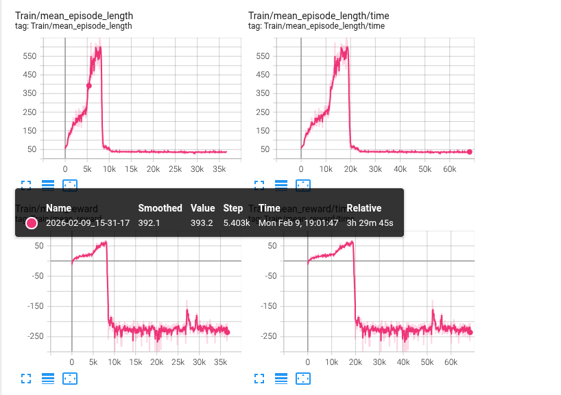

## 代码调试记录1.9

## 调试思路

**调试~/Documents/TienKung-Lab/legged_lab/envs/base/base_config:**

**`rel_standing_envs: 0.2 → 0.5`**
 提高站立/零速命令占比，使训练分布由“以走为主”转为“走停近乎各半”，显著增强停稳、姿态保持与抗扰动能力；代价是行走样本相对减少，行走性能收敛可能略慢。

**`resampling_time_range: (10,10) → (9,10)`**
 为命令持续时间引入轻微随机性，避免固定周期导致的时间相位过拟合，提升走停切换鲁棒性且不显著增加训练不稳定性。

结果：

2026-01-07_13-23-49 ： 

    resampling_time_range: tuple = (6.0, 7.0)
    rel_standing_envs: float = 0.4

2026-01-07_18-41-48：

    resampling_time_range: tuple = (9.0, 10.0)
    rel_standing_envs: float = 0.5


**调试~/Documents/TienKung-Lab/legged_lab/envs/tienkung/walk_cfg.py:**

```
stand_still_posture：
```

- `func=mdp.stand_still`
- `weight=-0.02`
- `joint_names=[".*_joint"]`（几乎所有关节）
- `zero_threshold=0.2`

这有两个典型风险：

1. **覆盖关节过宽**：连手臂/上身/颈部等都被强行拉回 default，可能导致在行走时也被“拽住”，让步态变僵、能量飙升、tracking 下降。
2. **权重可能偏大**（取决于 `mdp.stand_still` 的输出尺度）：如果它输出是“多关节 L1 求和”，那数值可能是 5～几十量级，乘以 -0.02 可能直接变成一个**大负项**，把其他奖励压扁。

修改一：

```python
stand_still_posture = RewTerm(
    func=mdp.stand_still,
    weight=-0.01,#原始为-0.02   修正权重可能偏大
    params={
        "asset_cfg": SceneEntityCfg(
            "robot",
            joint_names=[
                ".*_joint",
                ],
        ),
        "zero_threshold": 0.2,
        },
    )
```


**调试 在仿真中，机器人的运动命令需要确定：**

原始的控制方式可能是play文件里的：

```
    env_cfg.commands.ranges.lin_vel_x = (1.0, 1.0)
    env_cfg.commands.ranges.lin_vel_y = (0.0, 0.0)
```


现在已经在play和sim文件里加入了运动控制的命令：


**只改一个东西跑 2k～5k iter 看曲线**（不要一次改 5 个 term）

在 TensorBoard 里记录每个 term 的：

- mean(value)
- mean(weight*value)

判断问题属于哪类：

- A：跟踪差（tracking 低）
- B：抖动大（action_rate、acc 不够）
- C：脚滑（feet_slide / 摩擦）
- D：僵硬（posture/joint_deviation 过强）

按优先级调：

- 站立抖：先动 `action_rate`，再动 `stand_still_posture`
- 行走跟踪差：先减惩罚再加 tracking
- 走停切换不稳：`rel_standing_envs` + `stand_still`（但要防误伤行走）


##### 1、**训练模型：2026-01-09_13-46-39**

仿真路径：

```
python legged_lab/scripts/sim2sim.py --task walk --policy Exported_policy/walk_from_ckpt_6300.pt --duration 100 
```

**更改内容**

**rewards.py 文件**

添加奖励项：

```python
def stand_still_exp(
    env: BaseEnv,
    asset_cfg: SceneEntityCfg = SceneEntityCfg("robot"),
    zero_threshold: float = 0.2,
) -> torch.Tensor:
    """Penalize joint deviation when command is near zero (standing)."""
    cmd = env.command_generator.command
    zero_flag = (
        (torch.linalg.norm(cmd[:, :2], dim=1) + torch.abs(cmd[:, 2])) <= zero_threshold
    ).to(cmd.dtype)  # [N] float

    asset: Articulation = env.scene[asset_cfg.name]
    angle = (
        asset.data.joint_pos[:, asset_cfg.joint_ids]
        - asset.data.default_joint_pos[:, asset_cfg.joint_ids]
    )
    return torch.exp(-20*torch.sum(torch.abs(angle), dim=1)) * zero_flag

```


**随后修改walk_cfg.py文件：**

```python
    stand_still_exp = RewTerm(
    func=mdp.stand_still_exp,
    weight=5.0,  
    params={
        "asset_cfg": SceneEntityCfg(
            "robot",
           
            joint_names=[

                ".*_joint", 
            ],
        ),
        "zero_threshold": 0.2,
        },
    )
```

**结果**

```
还是原地踏步走，并且起步阶段不平稳
```

**下一步思路**

```
1、加大stand_still_exp的正向激励增大至 50 
2、在训练的时候要明确出来，行走和暂停的不同
3、添加新的停止时候的rewars
```

##### 2、训练模型2026-01-09_15-26-06

**调整了walk_cfg.py文件：**

weight调整到了50,但是没有什么效果

```python
    stand_still_exp = RewTerm(
    func=mdp.stand_still_exp,
    weight=50.0,  
    params={
        "asset_cfg": SceneEntityCfg(
            "robot",
           
            joint_names=[

                ".*_joint", 
            ],
        ),
        "zero_threshold": 0.2,
        },
    )
```

下一步

```
尝试别人的代码，并搞清楚问题处在那里
```


##### 使用CUDA 1卡死


使用命令：

```
python legged_lab/scripts/train.py \train.py \
  --task=pro_walk --headless --logger=tensorboard --num_envs=4096 \
  --log_name=pro_walk-original \
  --device=cuda:1

```

出现问题：

卡死不动

因为上面的命令不能完全切换到cuda 1

使用下面的：

```
CUDA_VISIBLE_DEVICES=1 PYTHONUNBUFFERED=1 \
python legged_lab/scripts/train.py \
  --task=pro_walk --headless --logger=tensorboard --num_envs=4096 \
  --log_name=pro_walk-original \
  --device=cuda:0 --info

```

## 调试pro_walk

| 模型名称                                    | 调试内容及表现                                               |
| ------------------------------------------- | ------------------------------------------------------------ |
| pro_walk-follow_lite                        | 在pro_walk中修改成lite_walk的参数，训练较慢，会出现崩溃      |
| pro_walk-follow_lite_waist                  | 添加了 **waist_joint_deviation_l1**  惩罚函数，权重为-0.5，还是会出现崩溃，行走大幅晃动，站立也会晃动 |
| pro_walk-minus_hip                          | 修改地形，修改髋关节rewards，站立表现不错，但是行走的时候还是会出现晃动，站立表现不错 |
| pro_walk-linear_signal                      | 保持上述修改，并将stand_still信号从阶跃信号修改成线性信号    |
| pro_walk-linear_signal                      | 对线性信号进行修改，采用孙师兄的高斯核方式，在25K达到训练稳定，站立表现不错，但是行走的时候晃动明显 |
| pro_walk-linear-sun                         | 使用高斯核，并使用sun师兄修改的walk_cfg   但是效果很差       |
| pro_walk-linear_signal_addhip _2            | zhang的表现很好，速度适中，                                  |
| pro_walk-linear_signal_shoulder_orientation | 效果特别差  摇晃剧烈，和zhang的表现不一样                    |
| pro_walk-linear_signal_arm_PD               | 保存了上面对于shoulder和orientation的修改 ，同步了PD ，feet_force  mirror_weight |


#### 1月23

调试模型：**pro_walk-follow_lite_waist** 添加了 **waist_joint_deviation_l1**  惩罚函数，权重为-0.5

模型表现：训练曲线**14K**到达900+，维持不长15.8K出现崩溃，后面**17K**又重新训练起来，而有又出现崩溃

出现问题：机器人站立不稳，机器人沿X轴和Z轴方向晃动

解决思路：

| 原因                                                         | 方案                                                         |
| :----------------------------------------------------------- | :----------------------------------------------------------- |
| `Curriculum/terrain_levels` 在 **~15K-16K** 附近从低等级快速爬升到 **level≈5**，随后又迅速掉回去，                       这是典型的：课程难度突然提高 → 大量环境开始频繁终止（跌倒/超限/接触触发）→ on-policy 数据质量急剧变差 → PPO 一两轮更新就会“打穿”当前策略稳定性 → 曲线坍塌。 | 暂时把 `max_init_terrain_level` 从 5 降到 **2 或 3**；       |
| 在“需要用髋关节做平衡”的时候，重罚了髋关节动作，<br/>现在： `hip_roll_action weight = -2.0` `hip_yaw_action weight = -1.0`非常容易导致：<br/> **策略不敢用髋 roll/yaw 去修正 COM → 只能用踝/膝/腰去补偿 → 出现低频摆动 + 过冲 → X/Z 晃动。** | 把 `hip_roll_action` 从 **-2.0 → -0.5** <br/>`hip_yaw_action` 从 **-1.0 →  -0.3** |
|                                                              |                                                              |

#### 1.26

调试模型：pro_walk-minus_hip，削减了髋关节相关权重

模型表现：站立已经挺好，但是walk的时候出现晃动

优化方向：添加了线性信号

在个孙师兄交流完之后 ，采用高斯核来作为线性信号。


#### 1.27

调试模型：pro_walk-linear_signal

模型表现：相较minus_hip走动缓慢，晃动轻微，停止表现不错。目前24K还在继续训练

目前25K 表现不错，有轻微的沿Z轴转动，抖动明显

```py
'''高斯核非线性'''
def gaussian(x, value_at_1):
    scale = np.sqrt(-2 * np.log(value_at_1))
    return torch.exp(-0.5 * (x*scale)**2)

def tolerance(x, bounds=(0.0, 0.0), margin=0.1, value_at_margin=0.1):
    lower, upper = bounds 
    assert lower < upper
    assert margin >= 0

    in_bounds = torch.logical_and(lower <= x, x <= upper)
    if margin == 0:
        value = torch.where(in_bounds, 1.0, 0)
    else:
        d = torch.where(x < lower, lower - x, x - upper) / margin
        value = torch.where(in_bounds, 1.0, gaussian(d.double(), value_at_margin))

    return value
```

#### 1.28

调试模型： pro_walk-linear_signal 使用高斯核的非阶跃信号 


模型表现：play的起步阶段机器人动作不正常，站立稳定，训练25K时速度稳定，但是walk的时候机器人中心不稳， 围绕Z轴晃动明显

调试思路：对比了lite_walk 的 tensorboard 曲线 发现 hip的约束是否可以更进一步

把 `hip_roll_action` 从 **-0.5 → -2.0** <br/>`hip_yaw_action` 从 **-0.3 →  -1.0**


#### 1.29

调试模型：pro_walk-linear-sun 使用高斯核，并使用sun师兄修改的walk_cfg  

模型表现：表现很差，直接崩溃


#### 2.2

调试模型：pro_walk-linear_signal_addhip   和pro_walk-linear_signal_addhip _2

模型表现：zhang的表现很好，但是我的训练的速度有问题偏快

但是现在还在训练，可以继续训练下去


#### 2.5

调试模型：pro_walk-linear_signal_shoulder_orientation

具体：

```python
body_orientation_l2 = RewTerm(
        func=mdp.body_orientation_l2, params={"asset_cfg": SceneEntityCfg("robot", body_names="pelvis")}, weight=-10.0 #权重修改到10
    )
```

```
另外：在stand_still里面打开了 shoulder_roll_.*_joint
```


#### 2.6

出现错误：

```bash
Traceback (most recent call last):
  File "/home/mig/Documents/tk_lab-tg2.0_lite/legged_lab/scripts/train.py", line 169, in <module>
    train()
  File "/home/mig/Documents/tk_lab-tg2.0_lite/legged_lab/scripts/train.py", line 163, in train
    runner.learn(num_learning_iterations=agent_cfg.max_iterations, init_at_random_ep_len=True)
  File "/home/mig/Documents/tk_lab-tg2.0_lite/rsl_rl/rsl_rl/runners/amp_on_policy_runner.py", line 318, in learn
    loss_dict = self.alg.update()
  File "/home/mig/Documents/tk_lab-tg2.0_lite/rsl_rl/rsl_rl/algorithms/amp_ppo.py", line 310, in update
    self.policy.act(obs_batch, masks=masks_batch, hidden_states=hid_states_batch[0])
  File "/home/mig/Documents/tk_lab-tg2.0_lite/rsl_rl/rsl_rl/modules/actor_critic.py", line 135, in act
    return self.distribution.sample()
  File "/home/mig/miniconda3/envs/TianG/lib/python3.10/site-packages/torch/distributions/normal.py", line 73, in sample
    return torch.normal(self.loc.expand(shape), self.scale.expand(shape))
RuntimeError: normal expects all elements of std >= 0.0
```


调试模型：pro_walk-follow_arm_PD

follow sun 修改胳膊pd：

```py
 #手臂整体变“更硬”，并且各关节的控制特性更一致。 （之前肩部比肘部更软，导致训练初期肩部动作过大，肘部动作过小，难以学到协调的动作。现在整体变硬，并且肩肘特性更接近，应该能学到更自然的动作。）
            stiffness={
                "shoulder_pitch_.*_joint": 80,
                "shoulder_roll_.*_joint": 80,
                "shoulder_yaw_.*_joint": 80,
                "elbow_pitch_.*_joint": 80,
            },
            # damping 也相应增加，并且肩肘特性更接近。
            damping={
                "shoulder_pitch_.*_joint": 5,
                "shoulder_roll_.*_joint": 5,
                "shoulder_yaw_.*_joint": 5,
                "elbow_pitch_.*_joint": 5,
            },
```


```python
    feet_force = RewTerm(
        func=mdp.body_force,
        weight=-1e-3,#原始是-3e-3
        params={
            "sensor_cfg": SceneEntityCfg("contact_sensor", body_names="ankle_roll.*"),
            "threshold": 500,
            "max_reward": 400,
        },
    )
```


```python
RslRlSymmetryCfg(
            use_data_augmentation=False,
            use_mirror_loss=True,#左腿/右腿、左臂/右臂做对称动作
            mirror_loss_coeff=20, #原始是50，mirror loss 权重较大，鼓励学习更对称的动作  上面那个loss的权重
            data_augmentation_func=mdp.data_augmentation_func_g1,
        ),
```


#### 2.10

昨天训练新的出现：

```python
[BAD OBS] nan: True inf: False min/max: nan nan
[BAD OBS] first bad index: [2185, 702] value: nan
Traceback (most recent call last):
  File "/home/mig/Documents/tk_lab-tg2.0_lite/legged_lab/scripts/train.py", line 169, in <module>
    train()
  File "/home/mig/Documents/tk_lab-tg2.0_lite/legged_lab/scripts/train.py", line 163, in train
    runner.learn(num_learning_iterations=agent_cfg.max_iterations, init_at_random_ep_len=True)
  File "/home/mig/Documents/tk_lab-tg2.0_lite/rsl_rl/rsl_rl/runners/amp_on_policy_runner.py", line 245, in learn
    actions = self.alg.act(obs, privileged_obs, amp_obs)
  File "/home/mig/Documents/tk_lab-tg2.0_lite/rsl_rl/rsl_rl/algorithms/amp_ppo.py", line 174, in act
    self.transition.actions = self.policy.act(obs).detach()
  File "/home/mig/Documents/tk_lab-tg2.0_lite/rsl_rl/rsl_rl/modules/actor_critic.py", line 153, in act
    raise RuntimeError("NaN/Inf in observations")
```


#### 2.11


新模型：pro_walk-total_follow_sun

按照gitlab里面sun提交的全部同步了pro_walk_cfg,  assets/tienkung2_pro/tienkung.py

还是出现了：

```python
[BAD OBS] nan: True inf: False min/max: nan nan
[BAD OBS] first bad index: [2185, 702] value: nan
Traceback (most recent call last):
  File "/home/mig/Documents/tk_lab-tg2.0_lite/legged_lab/scripts/train.py", line 169, in <module>
    train()
  File "/home/mig/Documents/tk_lab-tg2.0_lite/legged_lab/scripts/train.py", line 163, in train
    runner.learn(num_learning_iterations=agent_cfg.max_iterations, init_at_random_ep_len=True)
  File "/home/mig/Documents/tk_lab-tg2.0_lite/rsl_rl/rsl_rl/runners/amp_on_policy_runner.py", line 245, in learn
    actions = self.alg.act(obs, privileged_obs, amp_obs)
  File "/home/mig/Documents/tk_lab-tg2.0_lite/rsl_rl/rsl_rl/algorithms/amp_ppo.py", line 174, in act
    self.transition.actions = self.policy.act(obs).detach()
  File "/home/mig/Documents/tk_lab-tg2.0_lite/rsl_rl/rsl_rl/modules/actor_critic.py", line 153, in act
    raise RuntimeError("NaN/Inf in observations")
```

目前这个问题我解决不了阿 

为了先跑出一版结果 我打算先使用sun上传的最新code跑一版


#### 2.26 pro后倾

现在是根据师兄的pro_walk训练出了一版还算不错的，训练没有崩溃的代码

但是Iscca sim存在比较严重的问题

因为现在训练已经到了45K这个过程里面，不同阶段的表现是否有不同需要观察：

**PLAY**：

model_15200.pt：起步的时候有停顿，步行的时候姿态稳定，步行转停止的时候会有轻微晃动，后仰； 由停止转向步行的时候脚步过重，前倾。

model_45200.pt：起步停顿有改善，步行的时候姿态稳定，步行转停止的时候晃动不明显，后仰有改善；由停止转步行的时候脚步过重得到环节，前倾不明显

SIM2SIM 表现良好但有脚步过重的问题

SIM2REAL 出现身体后仰的问题。


进行新的代码调试：

```python
增大权重：
body_orientation_l2 
flat_orientation_l2
删除reward：
stand_still 
增加权重：目的：是为了约束在sim2real中身体后仰的bug
def hip_pitch_action(env: DexEnv) -> torch.Tensor:
    """Penalize hip pitch joint actions."""
    y_zero_flag = torch.abs(env.command_generator.command[:, 1]) < 0.1
    return y_zero_flag * torch.sum(torch.abs(env.action[:, [env.left_leg_ids[1], env.right_leg_ids[1]]]), dim=1)

```

下一步工作：

将新训练的policy完成sim2real验证，并整理代码


## lite_walk

#### 2.9

目前存在的问题是：

脚步有点重，身体有轻微摇晃

改进的点：

```python
    ang_vel_xy_l2 = RewTerm(func=mdp.ang_vel_xy_l2, weight=-0.1)#原先是0.05
    dof_acc_l2 = RewTerm(func=mdp.joint_acc_l2, weight=-2.5e-6)#原始是-2.5e-7
```

#### 2.10

出现了训练崩溃的情况



现在将

```python
    ang_vel_xy_l2 = RewTerm(func=mdp.ang_vel_xy_l2, weight=-0.1)#原先是0.05
    dof_acc_l2 = RewTerm(func=mdp.joint_acc_l2, weight=-2.5e-7)#改会原始值
```


## 调试lite_run


所以目前最好的是不加任何stand_still


|               模型名称               |                        调试内容及表现                        |
| :----------------------------------: | :----------------------------------------------------------: |
|  **speed=2.0_fellow_walk_nostand**   | 不使用任何stand_still rewards，**站立的时候出现向前动**     跑动的时候姿态比较稳定 |
|       lite_run-speed0.2-2stand       | 使用stand_still_exp  和stand_still，训练维持到2.5K并开始崩溃，还在行走** |
|     **lite_run-2.0speed-1stand**     |       使用stand_still_exp **站立时向前抖动，抖动强烈**       |
|   lite_run-2.0speed-all_lite_stand   |      **加上了所有rewards但是权重减半**，**训练不起来**       |
|        lite_run-linear_signal        |    将stand_still信号从阶跃信号修改成线性信号，训练不起来     |
|        lite_run-linear_signal        |                   采用高斯核依然训练不出来                   |
| lite_run-2.0speed_gaussian_no_angacc | 去除了stand_still_base_ang_acc 的reward 表现不错。是目前最好的。站立期间有robot会出现轻微抖动， |


#### **1.23**

**调试模型：lite_run-2.0speed-1stand 在 调试run的时候只添加了一个stand_still约束---stand_still_exp**

**模型表现： 站立不稳，但是训练曲线很好看，stand_still还在继续增长，目前训练到24.43K 可以继续**

**后续表现：训练到29K出现了崩溃**

**调试思路：stand_still从两个减少到一个是有效果的。后续尝试能不能降低权重。**

| **stand_still  weight=-0.5**                          | **stand_still  weight=-0.3**                           |
| ----------------------------------------------------- | ------------------------------------------------------ |
| **stand_still_exp  weight=7.0**                       | **stand_still_exp weight=3.5**                         |
| **stand_still_vel   weight=-0.05,**                   | **不变**                                               |
| **stand_still_feet_motion_penalty      weight=-0.5,** | **stand_still_feet_motion_penalty      weight=-0.25,** |
| **stand_still_base_ang_acc  weight=-0.5,**            | **stand_still_base_ang_acc  weight=-0.25,**            |
| **stand_still_double_support   weight=0.5**           | **stand_still_double_support   weight=0.25**           |


#### **1.26**

**调试模型：lite_run-2.0speed-all_lite_stand 使用了所有的stand_still但是调小了所有的权重**

**模型表型：直接崩溃训练不起来**

**play表现：完全死机**

**调试思路：能不能使用线性调整权重**

**添加如下函数：**

```python
def linear_signal(
    env,
    threshold: float = 0.2,
) -> torch.Tensor:
    command = env.command_generator.command
    cmd_mag = torch.norm(command[:, :2], dim=1) + torch.abs(command[:, 2])
    return (1.0 - cmd_mag / threshold).clamp(0.0, 1.0)
```


#### **1.27**

调试模型：lite_run-linear_signal

模型表现：将stand_still信号从阶跃信号修改成线性信号，训练不起来  采用高斯核依然训练不出来

改进思路：stand_still_base_ang_acc 在tensorboard中惩罚过于强烈 到-350左右，尝试改进,去掉了rewards，目前的训练还不错

模型表现：目前9.6K


#### 1.28

调试模型：	lite_run-2.0speed_gaussian_no_angacc

模型表现： 还不错