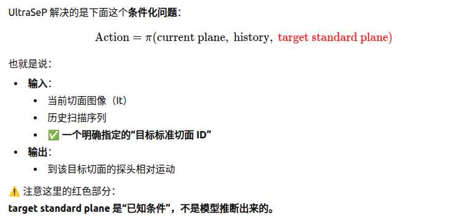

# 每天要做的事情

- [ ] 英语单词
- [ ] 刷代码
- [ ] SBIR
- [ ] 强化学习相关
- [ ] DINO


# 代码学习

### ubuntu常用命令


### conda 命令 

conda deactivate
conda env remove -n TianG

conda create -n TianG python=3.10 -y
conda activate TianG
pip install -U pip


g++ -std=c++17 -Wall -Wextra -Wpedantic -g src/hello.cpp -o build/hello 严格调试C++


tree -L 3  查看3级目录


### ros2 命令行

切换ros

source /opt/ros/noetic/setup.bash 

source /opt/ros/humble/setup.bash


colcon build 会将构建结果安装到一个目录中，默认是在 install/ 目录下。你可以通过以下命令源安装路径来使得工作空间中的所有可执行文件、库文件和 Python 包可用： 

source install/setup.bash

ros2 node list 查看当前的node
ros2 node info /turtlesim 查看这个node下的订阅 服务

ros2 topic list 查看当前的topic有哪些
ros2 topic echo /turtle/pose  为例 打印出当前的话题里面的内容

ros2 bag record /turtle1/cmd_vel （话题） 开始记录某个话题的数据
ros2 bag play rosbag2_2025_12_30-15_36_29/(文件)  播放记录的数据

1d27ecf38583de0c0dc337bd0805f6ca

ros2 pkg create --build-type ament_cmake learning_package_c  创建C++功能包
ros2 pkg create --build-type ament_python learning_package_py  创建python功能包


### C++命令


### 上机命令

**transtojit.py转换**

sh buildwebots.sh   使用这个调用虚拟环境
sh buildrobot.sh    调用上机环境

**webots仿真**

```
 webots webots/worlds/tg2_evt_lite.wbt
```


### 代码备忘录


# 天工代码


## 代码调用命令

### Tensorboard

**调出最近的checkpoint和 tensorboard**

```bash
latest_run=$(ls -dt logs/*/* | head -n 1)
echo "LATEST RUN: $latest_run"

echo "TensorBoard events:"
find "$latest_run" -type f -name "events.out.tfevents.*"

echo "Checkpoints:"
find "$latest_run" -type f \( -name "*.pt" -o -name "*.pth" \)
```

**查看TensorBoard**

```
tensorboard --logdir=logs  --port=6007
```


### Train

```
python legged_lab/scripts/train.py --task=walk --headless --logger=tensorboard --num_envs=4096

python legged_lab/scripts/train.py \
  --task=lite_run --headless --logger=tensorboard --num_envs=4096 \
  --log_name=lite_run-feet_near_2.2

```

```
python legged_lab/scripts/train.py \
  --task=pro_walk --headless --logger=tensorboard --num_envs=4096 \
  --log_name=pro_walk-original
```

```
CUDA_VISIBLE_DEVICES=1 PYTHONUNBUFFERED=1 \
 python legged_lab/scripts/train.py   --task=pro_walk --headless --logger=tensorboard --num_envs=4096  
  --device=cuda:0 --info

```


### Play

```
python legged_lab/scripts/play.py --task=walk --num_envs=1
```

修改 /home/mig/Documents/TienKung-Lab/legged_lab/envs/tienkung/walk_cfg.py   文件中的：来保证你现在play的到底是哪一个pt

```python
	 resume = False

​    \#load_run = ".*" #2026-01-05_19-55-14

​    load_run = "2026-01-06_16-13-51" #2026-01-05_19-55-14

​    \#load_checkpoint = "model_.*.pt"

​    load_checkpoint = "model_14500.pt"

```


### Sim2Sim(MuJoCo)

因为sim需要的pt文件出现不能用的情况，我从train导出的原始pt中又导了一下。调用下述代码：

```bash
  python export_jit_policy_from_ckpt.py \

​    --ckpt logs/lite_walk/2026-01-11_15-47-58/model_13000.pt \

​    --out  Exported_policy/walk_from_ckpt_13000.pt \

​    --obs-dim 750 \

​    --act-dim 20


```

调用仿真模块：（如果原始的walk.pt文件可以用）：

```bash
python legged_lab/scripts/sim2sim.py --task walk --policy Exported_policy/walk.pt --duration 100
```

如果不能用：

```bash
python legged_lab/scripts/sim2sim.py --task walk --policy Exported_policy/walk_from_ckpt_15000.pt --duration 100
 
python legged_lab/scripts/sim2sim.py --task walk --policy Exported_policy/walk_from_ckpt_6300.pt --duration 100 

```

### Webots sim

使用python_scripts目录下的torch2ov.py转换模型，

确保转换出的bin和xml文件在python_scripts/traced目录下

将文件地址赋给FSMStateImpl.cpp中的mlp_path变量


**修改 Joystick.h 文件里的手柄控制文件**

- FSMStateImpl.h中步态参数等相关变量取值应于训练时设置参数一致;
- RobotInterfaceImpl.cpp中关节位置增益joint_Kp_和关节速度增益joint_Kd_应与训练时设置参数一致。
- To build the code:

```plaintext
sh buildwebots.sh
```

```bash
 webots worlds/tg2_evt.wbt
```


**webots 进行的修改：**


1、修改采样频率：

```sh
 /home/mig/Documents/tg2_lab_sdk/robot_FSM/include/FSMState.h
 
 protected:
  double dt_ = 0.0025;
  int freq_ratio_ = 8;# 修改采样频率
  int joint_num_ = 27;
  int action_num_ = 21;
```

2、修改关节零位，默认位：

```python
/home/mig/Documents/tg2_lab_sdk/robot_FSM/FSMState/src

zero_pos << 0.0, -0.25, 0.0, 0.5, -0.25, 0.0,
      0.0, -0.25, 0.0, 0.5, -0.25, 0.0,
      0.0,
      -0.0, 0.1, 0.0, -0.5, 0.0, 0.0, 0.0,
      -0.0, -0.1, -0.0, -0.5, 0.0, 0.0, 0.0;
      

default_dof_pos << 0.0, -0.25, 0.0, 0.5, -0.25, 0.0,
      0.0, -0.25, -0.0, 0.5, -0.25, 0.0,
      0.0,
      0.0, 0.1, 0.0, -0.5, 0.0, -0.1, 0.0, -0.5;
```

3、修改PD

```python
/home/mig/Documents/tg2_lab_sdk/robot_interface/RobotInterfaceImpl/src/RobotInterfaceImpl.cpp


void RobotInterfaceImpl::SetCommand(RobotData &robot_data) {

  joint_kp_
      << 700.0, 700.0, 500.0, 700.0, 30.0, 16.8,
      700.0, 700.0, 500.0, 700.0, 30.0, 16.8,
      400.0,
      100.0, 100.0, 100.0, 100.0, 10.0, 10.0, 10.0,
      100.0, 100.0, 100.0, 100.0, 10.0, 10.0, 10.0;
  joint_kd_ << 10.0, 10.0, 5.0, 10.0, 2.5, 1.4,
      10.0, 10.0, 5.0, 10.0, 2.5, 1.4,
      4.0,
      5.0, 5.0, 5.0, 5.0, 1.0, 1.0, 1.0,	
      5.0, 5.0, 5.0, 5.0, 1.0, 1.0, 1.0;


```


### webots 上机

##### 1. 使用脚本转换模型

在项目中使用 `python_scripts` 目录下的 `torch2ov.py` 脚本进行模型转换。

##### 2. 检查转换结果

转换完成后，需要确认生成的bin和xml文件位于：

```
python_scripts/traced/
```

##### 3. 在 C++ 代码中配置模型路径

打开：

```
FSMStateImpl.cpp
```

找到其中的 `mlp_path` 变量。将 `mlp_path` 的值修改为：

- 转换后生成的 `.xml` 文件路径

##### 4. 修改手柄控制文件

打开 `Joystick.h` 文件，修改其中的**手柄控制相关内容**。

##### 5. 修改关节零位与默认位

训练的时候的关节位置：

```
/tk_lab/legged_lab/assets/tienkung2_pro/tienkung.py
```

打开目录：

```
/home/mig/Documents/tg2_lab_sdk/robot_FSM/FSMState/src
```

修改关节零位 `zero_pos` 和默认位 `default_dof_pos`。

**`zero_pos`**

```c++
zero_pos << 0.0, -0.25, 0.0, 0.5, -0.25, 0.0,
      0.0, -0.25, 0.0, 0.5, -0.25, 0.0,
      0.0,
      -0.0, 0.1, 0.0, -0.5, 0.0, 0.0, 0.0,
      -0.0, -0.1, -0.0, -0.5, 0.0, 0.0, 0.0;
```

**`default_dof_pos`**

```C
default_dof_pos << 0.0, -0.25, 0.0, 0.5, -0.25, 0.0,
      0.0, -0.25, -0.0, 0.5, -0.25, 0.0,
      0.0,
      0.0, 0.1, 0.0, -0.5, 0.0, -0.1, 0.0, -0.5;
```

------

##### 6. 修改 PD 参数

打开文件：

```
/home/mig/Documents/tg2_lab_sdk/robot_interface/RobotInterfaceImpl/src/RobotInterfaceImpl.cpp
```

找到函数：

```
void RobotInterfaceImpl::SetCommand(RobotData &robot_data)
```

修改其中的 `joint_kp_` 和 `joint_kd_` 参数。

**`joint_kp_`**

```
joint_kp_
    << 700.0, 700.0, 500.0, 700.0, 30.0, 16.8,
    700.0, 700.0, 500.0, 700.0, 30.0, 16.8,
    400.0,
    100.0, 100.0, 100.0, 100.0, 10.0, 10.0, 10.0,
    100.0, 100.0, 100.0, 100.0, 10.0, 10.0, 10.0;
```

**`joint_kd_`**

```
joint_kd_ << 10.0, 10.0, 5.0, 10.0, 2.5, 1.4,
    10.0, 10.0, 5.0, 10.0, 2.5, 1.4,
    4.0,
    5.0, 5.0, 5.0, 5.0, 1.0, 1.0, 1.0,
    5.0, 5.0, 5.0, 5.0, 1.0, 1.0, 1.0;
```

##### 7. Webots 编译与仿真

运行：

```
sh buildwebots.sh
```

作用：

- 创建 `build` 目录
- 创建 `bin` 目录
- 将所需文件安装到 `bin` 目录中

如果需要清理已有编译结果，运行：

```
sh cleanwebots.sh
```

作用：

- 删除 `build` 目录中的内容
- 删除 `bin` 目录中的内容

------

##### 运行 Webots 测试

操作流程：

1. 打开 Webots 软件

2. 点击 `Open World`

3. 打开与控制程序同路径下的机器人 `.wbt` 文件

   ```
    webots worlds/tg2_evt.wbt
   ```

------

##### 8. 上机部署

运行：

```
sh buildrobot.sh
```

作用：

- 编译机器人侧所需动态库

拷贝部署文件

将 `bin` 目录下的**所有内容**拷贝到机器人 x86 上 ROS 工程的以下目录：

```
src/rl_control_new/src/plugins/x_humanoid_rl_sdk
```

说明：

- `bin` 目录中的内容是部署到机器人侧运行所需的编译产物
- 拷贝完成后，机器人侧 ROS 工程即可调用对应插件/动态库

#### 上机操作笔记

##### 1. 连接机器人

先连接网线，然后通过 SSH 登录机器人：

```
ssh ubuntu@192.168.41.1
```

密码：

```
123
```

------

##### 2. 复制动态库文件

将编译生成的 `libx_humanoid_rl_sdk.so` 复制到机器人对应目录：

```
scp libx_humanoid_rl_sdk.so ubuntu@192.168.41.1:/home/ubuntu/ros2ws_hao/src/rl_control/src/plugins/x_humanoid_rl_sdk/lib
```

作用：

- 将本地生成的控制动态库部署到机器人 ROS 工程插件目录下

------

##### 3. 在机器人工作空间编译

进入机器人端工作空间：

```
cd ~/ros2ws_hao
```

执行编译：

```
colcon build
```

------

##### 4. 使用 tmux 管理运行窗口

进入远程连接后，建议使用 `tmux` 进行多窗口管理：

```
tmux
```

**常用操作**

新开一个分屏窗口：

```
Ctrl + B，然后 Shift + %
```

左右切换窗口：

```
Ctrl + B，然后方向键左 / 右
```

------

##### 5. tmux 中需要运行的内容

建议至少开两个窗口，分别运行：

- `body_control`
- `rl_control`

------

**窗口 1：Body_control**

依次执行：

```
sudo su
source install/setup.bash
ros2 launch body_control body.launch.py
```

完整形式参考：

```
ubuntu@ubuntu:~/ros2ws_hao$ sudo su
root@ubuntu:/opt/PARTITIONS/A/ros2ws# source install/setup.bash
root@ubuntu:/opt/PARTITIONS/A/ros2ws# ros2 launch body_control body.launch.py
```

作用：

- 启动机器人本体控制相关节点

------

**窗口 2：rl_control**

依次执行：

```
sudo su
source install/setup.bash
ros2 run rl_control rl_control_node
```

完整形式参考：

```
ubuntu@ubuntu:~/ros2ws_hao$ sudo su
root@ubuntu:/opt/PARTITIONS/A/ros2ws# source install/setup.bash
root@ubuntu:/opt/PARTITIONS/A/ros2ws# ros2 run rl_control rl_control_node
```

作用：

- 启动强化学习控制节点
- 进入策略推理运行阶段

------

##### 6. 上机手柄操作说明

**D 键**  默认通电。

**长按 A 键**   进入推理。

**C 键**  断掉推理。


## **工程框架**

### 三角度

**1) 三个角分别是什么（最直观）**

把物体想成一架飞机/一个相机/机器人躯干：

- **Roll（横滚/翻滚）**：身体“左右侧翻”
   直观：左肩抬起、右肩下沉（或反过来），像飞机“翻滚”。
- **Pitch（俯仰）**：头“抬头/低头”
   直观：机头上仰/下俯。
- **Yaw（偏航/航向）**：水平面“左转/右转”
   直观：改变朝向（heading），像转身朝左/朝右。

------

**2) 分别绕哪根轴转（取决于坐标系约定）**

在**右手笛卡尔坐标系**里，常见约定是：

- **Roll**：绕 **X 轴**旋转
- **Pitch**：绕 **Y 轴**旋转
- **Yaw**：绕 **Z 轴**旋转


**把它想成四层：**

**Layer A：仿真底座（Isaac Sim / Isaac Lab）**

- **负责：物理仿真、GPU PhysX、资产加载（USD articulation）、传感器、并行环境复制**

**Layer B：任务与 MDP（legged_lab）**

- **负责：定义任务（walk）、定义观测、动作映射、奖励（mdp.*）、终止条件、域随机化、命令生成器**
- **你发的 `LiteRewardCfg`、`TienKungWalkFlatEnvCfg` 就在这一层**

**Layer C：强化学习算法（rsl_rl / isaaclab_rl.rsl_rl）**

- **负责：PPO、AMP PPO、RND、对称性约束、rollout storage、GAE、优化器与调度器**

**Layer D：脚本与注册（scripts + task_registry）**

- **负责：把 cfg + env class 注册到 registry，提供 train.py 这样的入口把所有组件拼起来**


1. **`legged_lab/scripts/train.py`（你已经在看）**
2. **`legged_lab/utils/task_registry.py`（最关键：walk 如何映射到 cfg+class）**
3. **`legged_lab/envs/<tienkung>/...` 里 walk 对应的 env 文件（真正的 `env_class`）**
4. **`legged_lab/mdp/__init__.py` 与 reward 函数文件（你已经贴过）**
5. **`rsl_rl/runners/amp_on_policy_runner.py`（learn 循环与 AMP 如何混合 reward）**
6. **`rsl_rl/algorithms/amp_ppo.py`（AMPPPO 的 loss 公式与训练步骤）**

**这样你会非常快地把“入口 → 注册 → 环境 → reward → runner → algorithm”串起来。**

### **系统闭环**

**你跑 `python train.py --task=walk ...` 后，系统发生的 3 个闭环**

**闭环 1：控制闭环（Policy → Environment → Next Obs）**

1. **policy 根据 obs + command 输出 action**
2. **env.step(action) 在 Isaac Sim 里推进若干物理步（decimation）**
3. **env 返回 next_obs、reward、done、info（并行 N 个 env）**

**闭环 2：学习闭环（Rollout → GAE → PPO 更新）**

1. **采样一段 rollout（num_steps_per_env）**
2. **用 critic 估计 value，算优势 A_t（GAE）与 returns**
3. **PPO 多 epoch、多 mini-batch 更新 actor/critic**

**闭环 3：AMP 闭环（Expert vs Policy → Discriminator → AMP reward）**

1. **从 expert motion 文件采样“专家片段”（expert transitions）**
2. **从当前 policy rollout 抽“策略片段”（policy transitions）**
3. **训练判别器区分 expert/policy**
4. **用判别器输出构造 AMP reward，混到总 reward 里反向塑形 policy**

------

#### **1) `legged_lab/scripts/train.py`**

**它不懂“走路细节”，只做拼装与启动：**

- **解析参数：`--task=walk --num_envs=64 --headless --logger=tensorboard`**
- **启动 Isaac Sim：`AppLauncher`**
- **触发任务注册：`from legged_lab.envs import *`**
- **从 registry 拿三样东西：`env_cfg, agent_cfg, env_class`**
- **用 cfg 创建 env，用 agent_cfg 创建 runner**
- **`runner.learn()` 进入训练主循环**

> **train.py 是“总控开关”，不包含算法细节，也不包含任务细节。**

------

#### **2) `legged_lab/utils/task_registry.py`**

**：任务路由表（字符串 → 类与配置）**

**这是一个全局字典：**

- **`"walk"` → `env_class`（哪个环境类）**
- **`"walk"` → `env_cfg`（环境配置对象）**
- **`"walk"` → `agent_cfg`（训练配置对象）**

**它的价值是解耦：train.py 永远不需要写死 `TienKungWalkFlatEnvCfg` 这种类名，只要传一个字符串就行。**

> **注册通常发生在 `legged_lab/envs/__init__.py` 或子模块 import 的 side-effect 中。**

------

#### **3) `legged_lab/envs/<tienkung>/...`**

**：真正的环境实现（MDP 的“运行时引擎”）**

**这是项目“任务层”的核心：把 cfg 变成一个可交互的 `VecEnv`。**

**宏观上，这个环境类会实现（或组合实现）：**

- **场景构建：加载机器人 articulation、地形、传感器（contact、height scanner 等）**
- **状态与缓存：obs history、action buffer、episode buffers（reset_buf/time_out_buf）**
- **命令生成：command_generator 采样速度/航向指令（含站立比例）**
- **奖励管理：把 `LiteRewardCfg` 里每个 term 编译成可计算项（调用 mdp.reward 函数）**
- **终止与重置：接触终止、超时终止；reset 时执行 domain rand events**
- **step 流程：action → 物理推进（decimation）→ 更新传感器/状态 → obs/reward/done**

**你可以把 env 类看成：MDP 定义 + Isaac Sim 执行 的桥梁。**

------

#### **4) legged_lab/mdp/ reward**

 **文件：MDP 中的“数学部分”**

**这一层通常是“纯函数式”的：给定 env 的状态张量，计算某个 reward/penalty。**

**例如：**

- **跟踪速度：`exp(-||v_cmd - v||^2 / std^2)`**
- **姿态平衡：roll/pitch 相关惩罚**
- **接触约束：undesired contacts、feet slide、feet stumble**
- **动作平滑：action_rate、joint_acc**
- **站立/行走门控：`zero_flag = ||cmd|| < eps`（实现行为模式切换）**
- **gait clock：相位 mask（swing/stance）塑形步态**

**宏观重要点：**
 **reward 文件不是“环境执行”，而是“目标函数定义”。它决定策略最终学成什么样。**

------

#### **5) `rsl_rl/runners/amp_on_policy_runner.py`**

**训练循环的发动机（采样 + 更新 + 日志）**

**Runner 负责把 env 和算法连起来，核心职责是“把闭环跑起来”：**

- **Rollout：循环 num_steps_per_env 次**
  - **调 actor 得 action**
  - **env.step 得 obs/reward/done**
  - **存到 rollout buffer：obs, actions, rewards, dones, values, log_probs**
- **Compute returns/advantages：GAE（gamma, lam）**
- **优化：调用 algorithm 的 update（PPO/AMPPPO）**
- **AMP 扩展（AmpOnPolicyRunner 特有）**
  - **同时维护 expert buffer / policy buffer**
  - **训练 discriminator**
  - **计算 AMP reward 并混合到 task reward（受 `amp_task_reward_lerp`、`amp_reward_coef` 等控制）**
- **日志/保存：tensorboard、checkpoint**

**你可以把 runner 理解为：训练管线的流水线控制器。**

------

#### **6) `rsl_rl/algorithms/amp_ppo.py`**

**AMPPPO 的“数学更新规则”**

**这是最“算法层”的东西：定义 loss、反向传播、梯度更新。**

**宏观组成通常是三块（每次 update）：**

**6.1 PPO actor loss（clip）**

- **ratio = exp(new_logp - old_logp)**
- **clip ratio 到 [1-ε, 1+ε]**
- **取 min/或 max 形成 clipped objective**
- **用 advantage 做权重**

**6.2 PPO critic loss（value）**

- **MSE(return - value)**
- **常见还有 clipped value loss（你 cfg 里打开了）**

**6.3 AMP discriminator loss + AMP reward**

- **discriminator 学会区分 expert vs policy（类似 GAN 的判别器）**
- **用判别器输出构造一个“像专家就高分”的 reward**
- **最终总 reward 进入 advantage/return，从而影响 actor/critic 更新**

> **这就是为什么 AMP 能让动作“更像人走路”：它把“像专家”变成优化目标的一部分。**

------

**把 6 个模块连成一条“清晰的因果链”**

**你可以记住这条链：**

**train.py（启动/拼装）**
 **→ task_registry（把字符串映射到 env_class + cfg）**
 **→ env_class（把 cfg 变成可 step 的并行仿真环境）**
 **→ mdp.reward（env 在每步计算 reward term 的数学定义）**
 **→ AmpOnPolicyRunner（rollout + GAE + 调用算法更新 + 记录日志）**
 **→ AMPPPO（PPO loss + AMP 判别器 loss，做梯度下降）**
 **→ 更新后的 policy 回到 env 再采样（循环）**

------

**你现在最该先抓住的 3 个“宏观抓手”**

1. **数据结构抓手：runner 与 env 交互的最关键四元组**
   - **obs（policy 输入）**
   - **action（policy 输出）**
   - **reward（优化目标）**
   - **done/reset（数据分段与终止）**
2. **两类奖励抓手：task reward vs AMP reward**
   - **task reward：跟踪速度、稳定、不摔**
   - **AMP reward：像专家走路（风格/自然性）**
3. **门控抓手：command 决定“站立 vs 行走”的模式切换**
   - **很多 reward term 会用 `||cmd|| < eps` 作为开关**
   - **所以修改 reward 就能改变切换行为**


## **天工TensorBoard  参数**

### Curriculum/terrain_levels

**tag: `Curriculum/terrain_levels`**

- 这是“课程学习”的难度等级指标（你环境里是 terrain generator + max_init_terrain_level 等机制）。
- 一般含义：训练过程中，若机器人表现好（比如 episode 更长、reward 更高），就会被分配到**更高 terrain level**（更难的地形）；反之会降级。

### Episode_Reward

#### A. 跟踪类（希望它们“高”）

- `Episode_Reward/track_lin_vel_xy_exp`（权重 +4.0）
  - 你的实现是 `exp(-||cmd_xy - vel_xy||^2 / std^2)`，范围 (0,1]，越接近 1 越好。
  - 直观：机器人在“机体 yaw 坐标系”里速度跟命令越一致越高。
- `Episode_Reward/track_ang_vel_z_exp`（权重 +2.0）
  - `exp(- (cmd_wz - wz)^2 / std^2)`，越接近 1 越好。
- `Episode_Reward/alive_reward`（权重 +0.5）
  - 未终止为 1，终止为 0；如果它长期偏低，说明频繁摔倒/触发 reset。

#### B. 稳定性/姿态类（多为惩罚）

- `Episode_Reward/lin_vel_z_l2`（权重 -0.5）
  - 惩罚竖直方向速度（跳/蹦/下陷会大）。
- `Episode_Reward/ang_vel_xy_l2`（权重 -0.05）
  - 惩罚 roll/pitch 角速度（身体左右/前后晃会大）。
- `Episode_Reward/body_orientation_l2`（权重 -1.0）
  - 惩罚 pelvis 的姿态与重力方向不一致（等价于“别倾倒”）。
- `Episode_Reward/flat_orientation_l2`（权重 -0.5）
  - 惩罚 projected_gravity 的 x,y 分量（同样是“别倾倒”，但更“基座水平”取向）。

#### C. 能耗/平滑类（惩罚）

- `Episode_Reward/energy`（权重 -1e-3）
  - `|tau * qd|` 的范数，近似功率/能耗指标。
- - 
- `Episode_Reward/action_rate_l2`（权重 -0.01）
  - 连续两步 action 的差平方惩罚，抑制策略输出抖动。

#### D. 接触/足部行为（多数是惩罚：你希望它们“低”）

- `Episode_Reward/undesired_contacts`（权重 -1.0）
  - 监控膝盖/肩/肘/骨盆等是否发生“非期望接触”。大 = 经常摔/跪/手撑地。
- `Episode_Reward/feet_slide`（权重 -0.25）
  - 足端接触时的水平速度惩罚，反映打滑。
- `Episode_Reward/feet_force`（权重 -3e-3，threshold=500）
  - 足端 z 向力超过阈值后的惩罚（重踏/冲击大时上升）。
- `Episode_Reward/feet_stumble`（权重 -2.0）
  - 水平力远大于竖直力时判定“绊/刮”，常见于脚尖刮地、落脚姿态差。
- `Episode_Reward/feet_too_near`（权重 -2.0，threshold=0.2）
  - 两脚距离小于阈值就罚；解决“夹腿/交叉步”。

#### E. 关节姿态约束（惩罚：你希望它们“低”）

- `Episode_Reward/dof_pos_limits`（权重 -2.0）

  - 关节接近/超过限制时惩罚。

- `Episode_Reward/dof_acc_l2`（权重 -2.5e-7）

  - 关节加速度平方惩罚，抑制抖动（高频动作）。

- `Episode_Reward/joint_deviation_*`

  - `*_hip`（-0.15）：hip_yaw/hip_roll + 一些上肢关节偏离默认位姿
  - `*_arms`（-0.2）：肩 roll/yaw 偏离默认位姿
  - `*_legs`（-0.02）：腿部偏离默认位姿（较轻）
  - `waist_joint_deviation_l1`（-0.1）：腰关节偏离默认位姿
     这些项的作用是“让姿态别塌、别歪、别把关节拧到奇怪姿态”。

  #### F. 新增的“站立相关（stand_still 系列）”

  你截图第三页里有：

  - `Episode_Reward/stand_still`
    - 你现在用 **soft gate**：命令模长在 0~zero_threshold 附近才逐渐激活；命令越接近 0，gate 越接近 1。
    - 输出是 `sum(|q - q_default|)*gate`，**数值越大表示站立时关节偏离越大**。因为 weight 是负（-0.5），所以偏离大就扣分。
  - `Episode_Reward/stand_still_exp`（权重 +5.0）
    - 输出是 `exp(-dev)*gate`，dev 越小越接近 1。
    - 这是“站立姿态正确”的**正奖励**（鼓励 dev 小），和上面的惩罚项形成“推拉”。
  - `Episode_Reward/stand_still_vel`（权重 -0.02）
    - 站立时关节速度惩罚（动得多就扣分）。
  - `Episode_Reward/stand_still_feet_motion_penalty`（权重 -0.5）
    - 站立时足部运动惩罚（脚在地上乱滑/乱抖会变大）。
  - `Episode_Reward/stand_still_double_support`（权重 +0.5）
    - 站立时双脚都接触给奖励（避免单脚点地、虚浮）。


#### **天工TensorBoard  Loss参数**

#####  **Loss / amp**

**AMP（Adversarial Motion Prior）通常把“让策略动作像 expert”的目标写成一个对抗学习问题：**

- **一个 判别器 D(s) 区分“expert 轨迹”与“policy 轨迹”**
- **policy 通过 AMP reward（来自 D）被驱动去“骗过判别器”**

**`Loss/amp` 一般就是 AMP 判别器训练的总 loss（或其监控指标），常由三部分组成：**

****

**它反映 判别器是否在学习、是否已经饱和、是否出现崩坏（过强/过弱）。**

**典型形态怎么读**

- **下降并趋稳：判别器学到了较稳定的区分边界（正常）**
- **长期振荡但不发散：对抗达到动态平衡（正常/可接受）**
- **突然飙升或归零：判别器训练出问题（数据、学习率、梯度惩罚、归一化等）**

**你当前图里 `amp` 大致稳定在一个范围内并振荡，通常意味着：**

> **判别器训练稳定，但对 policy 提供的“可用学习信号”可能已经变弱（饱和）。**


##### **Loss / amp_expert_pred**

**这是“判别器对 expert 样本的输出（或对应损失）”的监控。**
 **不同实现可能记录：**

- **D(expert) 的平均输出（越接近“expert”越好）**
- **或 expert 分类损失（越低越好）**

**你写的“Expert 数据被判别为 expert 的置信度”属于第一种解释。**

**它告诉你：**

- **判别器是否能把 expert 看成 expert（否则判别器坏了）**
- **expert 数据预处理/归一化是否对齐 policy 数据（否则分布漂移）**

- **D(expert) 很高且稳定：判别器至少能识别 expert（正常）**
- **D(expert) 逐渐变差：判别器训练不稳或 expert 数据输入格式有问题**
- **D(expert) 过饱和（长期极端值）：判别器可能过强，导致 policy 梯度“无信息”**


#####  **Amp_grad_pen**

**WGAN-GP 风格的梯度惩罚项，防止判别器变得过尖锐导致不稳定：**

**它是 AMP 稳定性的“保险丝”。**

- **太小：判别器可能过度尖锐，训练会抖/崩**
- **太大：判别器被强行压平，学习能力不足，policy 得不到有效信号**

**怎么读**

- **稳定在中等水平：通常正常**
- **持续增大：判别器梯度在变“野”，可能学习率偏大、输入未归一化或 reward/obs 分布漂移**
- **接近 0 且 amp_expert_pred/amp_policy_pred 也饱和：判别器可能被“压平 + 饱和”，给不出信息**


##### **Amp_policy_pred**

**策略样本被判别成 expert 的概率（越接近 expert 越好）**

**判别器对 policy 样本的输出（或其损失）。**

- **D(policy) 越高 ⇒ policy 越像 expert**

**这是 AMP 对 policy 的核心反馈：**

- **如果 policy 越来越像 expert，这个指标应逐步“向 expert 方向移动”**
- **如果长期不动，说明 AMP reward 对 policy 已经没有驱动力（或被其他惩罚项压住）**

- **持续改善并趋稳：AMP 在发挥作用**

- **早期改善，后期平台：AMP 信号饱和/被 PPO 稳定项锁死**

- **后期反向恶化：policy 被 task reward/penalty 拉偏，AMP 拉不回来（常见于你这种 reward 惩罚过强）**

  

**Entropy** 

**策略分布的不确定性。对高斯策略（连续动作）：**

****

**很多 logger 记录的是 entropy 本身，也可能记录 `-entropy`（看实现）。**
 **你图里从高到低快速下降，并在较低值平台，符合“探索快速消失”。**

**entropy 是 PPO 的“探索温度计”：**

- **太高：策略太随机，学不稳**

- **太低：策略过早确定，容易陷入局部最优并停止改进（你现在的典型状态）**

  

- **初期下降：正常（从随机探索走向收敛）**
- **下降后仍缓慢变化：健康（还能继续微调）**
- **过早降到很低且长期平：策略冻结（PPO 更新幅度小、KL 小、优势小、lr 小）**


#####  **Learning_rate**

**优化器当前 LR（可能来自 schedule）。**

**LR 决定 PPO 更新“能不能动起来”。如果你这里几乎掉到 0：**

> **那么后面即使 reward 有信号，网络参数也基本不会更新。**

- **`constant` 或缓慢 decay：常见**
- **很快衰减到接近 0：常见误配置（scheduler 太激进、总步数设错、warmup/anneal 逻辑有 bug）**

**工程上，如果你想继续学习，通常应该设置：**

- **LR 下限（floor），例如 `min_lr=3e-5`**

- **或直接 constant LR（至少在早期）**

  

##### **Surrogate**

**PPO 的核心目标（clipped surrogate objective），一般监控的是 负的目标值 或其均值：**

**logger 若记录为 `loss/surrogate`，常见是把要最大化的目标取负号后变成“loss”。**

**为什么重要**

**它直接反映：**

- **优势 $A_t$ 是否有信号**
- **policy 更新是否在发生**
- **clip 是否频繁触发（更新太大/太小）**

**怎么读**

- **有波动且有趋势：在学习**
- **长期稳定在一个小幅区间：policy 更新很小、优势很小、或 LR 太小/entropy 太低导致冻结**
- **如果你同时看到 entropy 低、lr 低，那 surrogate 稳定基本就是“没在学”**


**Value_function**


**价值函数拟合误差（MSE/Huber）：**
$$
L_V = \mathbb{E}\big[(V_\phi(s_t) - \hat{R}_t)^2\big]
$$


**为什么重要**

**critic 质量决定 advantage 质量，进而决定 policy 更新方向是否正确。**

**怎么读**

- **初期较高，随后下降或趋稳：正常**
- **持续上升：常见原因：**
  1. **回报分布在变（reward shaping、termination、AMP reward scale 变化）**
  2. **critic 学习率/容量不够**
  3. **policy 冻结导致采样分布单一，但 returns 噪声仍在（critic 会“学不准”）**
  4. **归一化（obs/reward/advantage）不一致**

**你之前的图里 value_function 有上升趋势，这通常提示：**

> **不是数值爆炸，而是“critic 正在跟不上 returns 的结构”，常由 reward 失衡 + policy 冻结引发。**


#### **天工TensorBoard  Perf参数**

##### **Perf / collection_time**

**采样时间（环境交互耗时）**

**📈 你图中表现：**

- **稳定在 ≈ 0.41 s**
- **波动很小，没有趋势性增长或下降**


##### **Perf / learning_time**

**单次更新（反向传播）耗时**

**📈 你图中：**

- **稳定在 ~0.061s**
- **波动极小**

**解释：**

- **网络规模、batch size、optimizer 都是稳定的**
- **GPU 没有过载**
- **没有出现梯度爆炸 / NaN**

#####  **total_fps**

**整体训练速度（env step / second）**

**📈 你图中：**

- **大约在 3200–3300 fps 波动**
- **稳定，没有明显下降**

**解释：**

- **并行环境数合理**
- **没有性能瓶颈**


#### **天工TensorBoard  Train参数**

##### **Train / mean_episode_length**

（平均 episode 长度）

📈 走势：

- 从 ~65 持续上升到 ~81
- 稳定增长，没有回落

解读：

- agent 越来越不容易“失败”
- episode 更长

##### **Train / mean_episode_length_time**

这是 episode 的真实时间长度（秒）。

📈 从 ~80s → ~85s

说明：

- 与 step 数一致增长
- 不是 simulation bug


##### **Train / mean_reward**

📈 你这条非常关键：

- 从大约 -1.2 → -0.3
- 持续上升，但始终为负
- 后期上升明显变慢

解释：

- reward 确实在变好（模型在学）
- 但被 负项（惩罚）主导
- 永远“赚不到正收益”

这和你 reward 里：

- energy
- dof limits
- ankle torque
   等项过强完全一致。


##### **Train / mean_reward_time**

这条是 time-weighted reward（随时间累计）

表现：

- 趋势类似
- 抖动更明显（因为 reward 波动）

说明：

- 模型在某些阶段尝试“走”，但很快被惩罚拉回


# **强化学习** 

## **策略梯度算法**

**给定参数化策略**  
\[
\pi_\theta(a \mid s)
\]

**目标是最大化期望折扣回报：**
\[
J(\theta)
=
\mathbb{E}_{\tau \sim \pi_\theta}
\left[
\sum_{t=0}^{T-1} \gamma^t r_t
\right]
\]

**其中轨迹**  
\[
\tau = (s_0, a_0, r_0, s_1, a_1, r_1, \dots)
\]
**由策略与环境交互采样得到。**


### **策略梯度定理（REINFORCE 核心）**

**使用 log-derivative trick：**

\[
\nabla_\theta J(\theta)
=
\mathbb{E}
\left[
\sum_{t=0}^{T-1}
\nabla_\theta \log \pi_\theta(a_t \mid s_t)
\;
G_t
\right]
\]

**其中蒙特卡洛回报：**
\[
G_t
=
\sum_{k=t}^{T-1} \gamma^{k-t} r_k
\]

**因此可构造最小化损失函数：**
\[
\mathcal{L}(\theta)
=
- \mathbb{E}
\big[
\log \pi_\theta(a_t \mid s_t)\; G_t
\big]
\]

**对该 loss 做梯度下降  
⇔  
对 \( J(\theta) \) 做梯度上升。**


**优化对象：**
$$
\theta \leftarrow \theta + \alpha \frac{1}{T}\sum_{t=0}^{T-1} A_t \nabla_\theta \log\pi_\theta(a_t|s_t)
$$

- **注意这里是一个 乘积：**

  - $$
    \nabla_\theta \log \pi_\theta(a_t \mid s_t)
    $$
    
    ****
    **👉 是一个 向量（维度 = 参数个数）**
    
  - $$
    A_t
    $$
    
    **👉 是一个 标量权重**


$$

$$

## **A2C算法**


## **PPO算法**

##### **GAE**

**GAE（Generalized Advantage Estimation，广义优势估计）**
 **是一种 用 TD 残差的指数加权和来估计优势函数 A(s_t,a_t) 的方法，用来在高方差（Monte Carlo）和高偏差（TD）之间做连续可调的折中。**

###  **V、Q、A、r 的含义与关系**

**在强化学习（尤其是 PPO / Actor–Critic 方法）中，r、V、Q、A 是最核心、但也最容易混淆的四个概念。下面从定义 → 数学形式 → 直觉理解 → 代码对应四个层面统一说明。**

------

####  **r** 

**—— Reward（即时奖励）**

**数学定义**
$$
r_t = r(s_t, a_t, s_{t+1})
$$
**含义**

> **环境在当前时间步给出的即时反馈**

- **来自环境，而非模型学习**
- **只反映“当前这一步”的好坏**
- **不包含对未来的直接判断**

**直觉理解**

> **“我刚刚这一步，环境给我打了多少分？”**

**CartPole 中**

- **每一步未倒：`r = 1`**
- **杆倒或越界：episode 结束**

**PPO 代码中的位置**

```
next_obs, reward, terminated, truncated, _ = env.step(action)
```

**这里的 `reward` 即 $r_t$。**

------

#### **V** 

**—— State Value Function（状态价值函数）**

**数学定义**
$$
V^\pi(s) = \mathbb{E}_\pi\!\left[\sum_{k=0}^{\infty} \gamma^k r_{t+k} \;\middle|\; s_t = s\right]
$$
**含义**

> **站在状态 s上，在当前策略 pi下，未来还能期望获得多少累计回报**

- **只与状态有关，不指定动作**
- **是一个期望值（平均意义）**
- **由 Critic 网络近似学习**

**直觉理解**

> **“这个位置整体上值不值？”**

**PPO 代码中的位置**

```
logits, value = model(obs)
```

**其中 `value` 即 V(s_t)**

------

#### **Q** 

**—— Action-Value Function（动作价值函数）**

**数学定义**
$$
Q^\pi(s,a) = \mathbb{E}_\pi\!\left[\sum_{k=0}^{\infty} \gamma^k r_{t+k} 
\;\middle|\; s_t = s,\; a_t = a\right]
$$
**含义**

> **在状态 $s$ 下，如果当前这一步选择动作 $a$，未来期望能获得多少累计回报**

- **同时依赖状态和动作**
- **粒度比 V 更细**
- **在 DQN 等方法中会被显式建模**

**直觉理解**

> **“在这个位置，走这一步值不值？”**

**在 PPO 中如何得到 Q？**

**PPO 不显式学习 Q 网络，而是使用一步 bootstrap 近似：**
$$
Q(s_t,a_t) \;\approx\; r_t + \gamma(1-d_t)V(s_{t+1})
$$


#### **证明**

**把“未来回报”拆成“第一步 + 剩余部分”**

**对无穷和做代数拆分：**
$$
\sum_{k=0}^{\infty}\gamma^k r_{t+k}
=
r_t
+
\gamma \sum_{k=0}^{\infty}\gamma^k r_{t+1+k}
$$
**这是纯代数恒等式。**

**代回 Q 的定义：**
$$
Q^\pi(s_t,a_t)
=
\mathbb{E}_\pi
\!\left[
r_t
+
\gamma \sum_{k=0}^{\infty}\gamma^k r_{t+1+k}
\;\middle|\;
s_t,a_t
\right]
$$
**现在关注后半项：**

**通过公式可以证明**
$$
\mathbb{E}_\pi
\!\left[
\sum_{k=0}^{\infty}\gamma^k r_{t+1+k}
\;\middle|\;
s_{t+1}
\right]
=
V^\pi(s_{t+1})
$$


**理论层面（严格）**
$$
Q^\pi(s,a)
=
\mathbb{E}\big[
r + \gamma V^\pi(s')
\big]
\qquad \text{（严格成立）}
$$

------

**算法层面（PPO / Actor–Critic）**

**在实际算法中：**

- **真实的 $V^\pi$ 不可得**
- **只能使用一个学习到的 Critic 网络：**

$$
V_\phi(s) \approx V^\pi(s)
$$

**于是，在样本层面使用：**
$$
Q(s_t,a_t)
\;\approx\;
r_t + \gamma V_\phi(s_{t+1})
$$


------

#### **A** 

**—— Advantage Function（优势函数）**

**数学定义**
$$
A^\pi(s,a) = Q^\pi(s,a) - V^\pi(s)
$$
**含义（PPO 的核心）**

> **在当前状态下，选这个动作比“平均动作”好多少**

- **是一个相对量**
- **$A > 0$：好于平均，应该提高概率**
- **$A < 0$：差于平均，应该降低概率**

**为什么策略梯度用 A？**

- **直接用 Q → 方差大**
- **减去 V 作为 baseline → 不改变期望梯度，但显著降低方差**

**PPO 代码中的位置**

**优势由 TD 残差 + GAE 计算：**

```
buffer.compute_gae(...)
adv_b = buffer.advantages
```

------

#### **四者之间的因果关系**

```
环境反馈：        r_t
                   ↓
Critic 估计：   V(s_t), V(s_{t+1})
                   ↓
一步 Q 近似：   Q(s_t,a_t) ≈ r_t + γ V(s_{t+1})
                   ↓
优势定义：     A(s_t,a_t) = Q - V(s_t)
```

------

#### **在 PPO 中各自的角色分工**

| **量** | **来源**        | **作用**                 |
| ------ | --------------- | ------------------------ |
| **r**  | **环境**        | **提供真实即时反馈**     |
| **V**  | **Critic 网络** | **baseline + bootstrap** |
| **Q**  | **隐式近似**    | **构造优势**             |
| **A**  | **GAE 计算**    | **Actor 更新方向**       |

------

#### **一句话终极记忆法**

> **r 是当下发生的事，
>  V 是站在这里的总体期望，
>  Q 是走这一步后的长期价值，
>  A 是“这一步比平均好多少”。**


在**右手坐标系**下：

| 旋转轴   | 名称（工程/机器人） | 常用记号 | 含义            |
| -------- | ------------------- | -------- | --------------- |
| **X 轴** | Roll（滚转）        | $\phi$   | 左右翻滚        |
| **Y 轴** | Pitch（俯仰）       | $\theta$ | 前后抬头 / 低头 |
| **Z 轴** | Yaw（偏航）         | $\psi$   | 水平面内转向    |


# **超声导航**

## **文章总揽**

**清华大学 × 北京智源**

**清华 Cardiac Copilot: Automatic Probe Guidance for Echocardiography with World Model    [Jiang, Haojun](https://papers.miccai.org/miccai-2024/tags#Jiang, Haojun)**

**清华 UltraSeP: Sequence-aware pre-training for echocardiography probe movement guidance 和上面同课题组**

**清华 EchoWorld: Learning Motion-Aware World Models for Echocardiography Probe Guidance 同课题组**

**VA-Adapter: Adapting Ultrasound Foundation Model to Echocardiography Probe Guidance**


**英国 Oxford / King’s College London** 

**Droste et al., Automatic probe movement guidance for freehand obstetric ultrasound（MICCAI 2020）**


**美国 × 商业医疗 AI（Narang / JAMA Cardiology）**

**Utility of a deep-learning algorithm to guide novices to acquire echocardiograms（JAMA Cardiology, 2021）**


**日本东京大学 / 岩田弘一（Iwata Lab） 机器人心脏超声**

**Automated image acquisition of PLAX with robotic echocardiography（RA-L 2023）**

**Diagnostic posture control system for seated-style echocardiography robot（IJCARS 2023）**


**[Guide2Heart: Proximity Guidance for Standard Echocardiographic View](https://link.springer.com/chapter/10.1007/978-3-032-06329-8_18)  2025年9月 印度理工学院 发表在 Simplifying Medical Ultrasound**

**[Real-Time Echocardiography Guidance for Optimized Apical Standard Views](https://www.sciencedirect.com/science/article/pii/S0301562922005658)   2023年1月 挪威科技大学  David Pasdeloup** 


#### **Cardiac Copilot**

**在临床实践中，心脏超声检查的最终目标是定位各个标准二维切面，并在这些切面上观察心脏的结构与功能。因此，我们旨在训练一个引导网络，使其能够直接预测当前探头位置与目标切面之间的相对位姿关系，而无需显式考虑中间运动路径，从而实现面向目标的引导策略。**


#### **UltraSeP**

****


#### **EchoWorld**


**EchoWorld 和 Cardiac Copilot 解决的是同一类核心问题：**
 **从任意超声切面出发，基于图像与探头运动信息，预测到目标标准切面的引导动作。**
 **EchoWorld 的创新在于：把“探头运动—视觉变化”的因果关系显式建模为世界模型，并通过 motion-aware attention 在序列决策中注入几何结构，从而在离线导航精度上显著优于既有方法。**


**VA-Adapter**

**“The objective of our probe movement guidance task is to predict the relative movement action from any given plane to the ten standard planes.”**

**从任意当前位姿 → 某一个标准切面的“相对位姿变换”**


# 2D检索论文

### 期刊

Q1 中科院3 区 Image and Vision Computing 影响因子4.2


## 想法


# 机器人硬件学习

### PD增益

暂时没有学会


Q1 中科院2区 Information Science 影响因子6.8

Q1  中科院3区 Pattern Recognition Letters  影响因子 4


