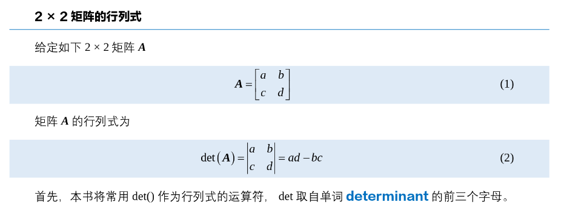
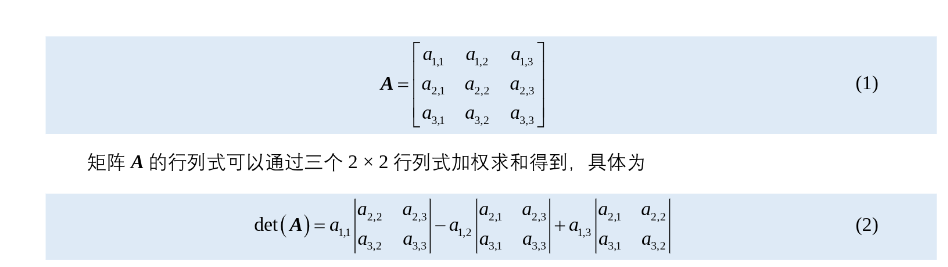

# 数学学习

## 线性代数

### 矩阵

#### 对角矩阵

**一、对角矩阵（Diagonal matrix，对角矩阵）**

形式长这样：
$$
A=\begin{bmatrix}
a_1 & 0 & 0\\
0 & a_2 & 0\\
0 & 0 & a_3
\end{bmatrix}
$$
特点一句话

👉 **只有主对角线有数，其它全是 0。**

------

最重要的直觉

👉 每一维只被自己缩放，不和别的维度混。

------

非常重要的一个性质（和你前面学的逆直接相关）

如果所有 $a_i \neq 0$：
$$
A^{-1}=\begin{bmatrix}
1/a_1 & 0 & 0\\
0 & 1/a_2 & 0\\
0 & 0 & 1/a_3
\end{bmatrix}
$$
👉 对角矩阵的逆：**直接对对角线取倒数。**

------

------

#### **对称矩阵**

**二、对称矩阵（Symmetric matrix，对称矩阵）**

定义非常简单：
$$
A = A^T
$$
也就是：

👉 **转置等于自己。**

如果 A是一个对称矩阵，那么它的逆矩阵也是对称矩阵

------

举个直观例子：
$$
A=\begin{bmatrix}
1 & 2 & 3\\
2 & 4 & 5\\
3 & 5 & 6
\end{bmatrix}
$$
你会看到：

- 左下角 = 右上角

------

一句话理解

👉 以主对角线为镜子，对称。

------

工程里你最需要记住的一点

👉 很多重要矩阵（比如协方差矩阵、信息矩阵）都是对称的。

------

------

#### 正交矩阵

**三、正交矩阵（Orthogonal matrix，正交矩阵）**

定义：
$$
Q^T Q = I
$$

------

最关键的一句话

👉 **转置就是它的逆。**
$$
Q^{-1}=Q^T
$$

------

直觉理解（非常重要）

正交矩阵表示：

👉 纯旋转（或旋转 + 翻转）

也就是说：

- 不拉伸
- 不缩放
- 只改变方向

------

非常直观的性质

- 向量长度不变
- 角度不变


| 矩阵     | 一句话理解             | 最重要性质             |
| -------- | ---------------------- | ---------------------- |
| 对角矩阵 | 只在每个维度上单独缩放 | 逆很简单：对角线取倒数 |
| 对称矩阵 | 关于主对角线对称       | A=AT                   |
| 正交矩阵 | 纯旋转 / 翻转          | Q^{-1}=Q^T             |

### 矩阵的逆

**一、定义（最核心）**

对方阵 \(A \in \mathbb{R}^{n\times n}\)，如果存在矩阵 \(A^{-1}\)，使得

$$
A A^{-1} = A^{-1} A = I
$$

则称 \(A^{-1}\) 为 \(A\) 的逆矩阵。

---

**二、什么时候存在逆？（可逆条件）**

下面条件彼此等价（任意一条成立即可）：

- \(\det(A) \neq 0\)
- \(\mathrm{rank}(A) = n\)（满秩）
- 线性方程组 \(Ax = b\) 对任意 \(b\) 都有唯一解
- 0 不是矩阵 \(A\) 的特征值
- 矩阵的行向量（或列向量）线性无关

---

**三、与线性方程的关系（最重要的用法）**

若

$$
Ax = b
$$

且 \(A\) 可逆，则

$$
x = A^{-1} b
$$

但在数值计算中，通常**不直接计算逆矩阵**，而是使用

```python
x = np.linalg.solve(A, b)
```

**四、基本性质（常用恒等式）**

- \((AB)^{-1} = B^{-1} A^{-1}\)

- \((A^T)^{-1} = (A^{-1})^T\)

- \((kA)^{-1} = \dfrac{1}{k} A^{-1}\)，其中 \(k \neq 0\)

- 若矩阵 \(A\) 可逆，则线性方程组的解唯一

------

**五、解析表达（与余子式的联系）**

逆矩阵可以写成
$$
A^{-1} = \frac{1}{\det(A)} \, \mathrm{adj}(A)
$$
其中 adj(A) 为矩阵  A 的伴随矩阵（代数余子式矩阵的转置）。

该公式主要用于理论推导，在工程数值计算中很少直接使用。

------

**六、数值实现（实际编程中如何做）**

解线性方程（首选）

```
x = np.linalg.solve(A, b)
```

显式求逆（不推荐，除非确实需要）

```
A_inv = np.linalg.inv(A)
```

不可逆或超定 / 欠定问题

```
x = np.linalg.lstsq(A, b, rcond=None)[0]
```

或

```
A_pinv = np.linalg.pinv(A)
```

------

**七、病态矩阵与条件数**

即使矩阵可逆，也可能数值上不稳定。可用条件数判断：

```
np.linalg.cond(A)
```

条件数越大，说明问题越病态，逆矩阵带来的误差放大越严重。

在这种情况下，更应使用分解方法（如 `solve`、`lstsq` 等）。

------

**八、常见特殊矩阵的逆**

- **对角矩阵**

  若
  $$
  A = \mathrm{diag}(d_1,\ldots,d_n)
  $$
  则
  $$
  A^{-1} = \mathrm{diag}(1/d_1,\ldots,1/d_n)
  $$

- **正交矩阵 $Q$**（满足 Q^Q_T = I）
  $$
  Q^{-1} = Q^T
  $$

- **对称正定矩阵（SPD）**

  实际数值计算中通常采用 Cholesky 分解：

  ```
  L = np.linalg.cholesky(A)
  ```

------

**九、逆矩阵与伪逆的区别**

- 逆矩阵只对可逆方阵存在
- 伪逆（Moore–Penrose 逆）对任意矩阵都定义，常用于最小二乘问题

```
A_pinv = np.linalg.pinv(A)
```

------

**十、总结（可直接作为笔记）**

矩阵的逆表示线性变换的反变换。
 矩阵可逆当且仅当其满秩（等价于 $\det(A) \neq 0$）。
 在数值计算中，应优先使用线性方程求解或分解方法（如 `solve`、`lstsq`），而不是显式计算逆矩阵；条件数用于判断矩阵是否病态。

### 伴随矩阵

主要用来求 逆  


### 行列式






### 向量组

- **线性无关**：
   没有一个向量能由其它向量线性组合得到（没有“多余向量”）。
- **线性相关**：
   至少有一个向量能由其它向量线性组合得到（存在“冗余向量”）。
- **rank（秩）**：
   一组向量中，**真正独立的向量个数**（也就是独立方向的数量）。


## 知识点

### exp和线性的对比

**stand_still 与 stand_still_exp 的数学差别**

设关节偏差为
$$
d=\sum_i |q_i-q_i^{default}|
$$
（gate 只是平滑开关，这里只讨论核心形式）

------

**1. stand_still（线性惩罚）**

形式：
$$
R(d)=d
$$
（通常外面乘负权重，作为 penalty）

性质：

- 无界
- 梯度为常数

$$
\frac{dR}{dd}=1
$$

含义：

- 对所有偏差大小都持续施加同样强度的惩罚
- 属于**硬约束型正则**

工程影响：

- 偏差再大也会被强烈拉回 default pose
- 容易与行走 / tracking / AMP 奖励产生冲突
- 在站立 → 行走过渡阶段，仍然会“拉住身体”

------

**2. stand_still_exp（指数奖励）**

形式：
$$
R(d)=e^{-d}
$$
性质：

- 有界：0<R<1
- 梯度随偏差增大快速衰减：

$$
\frac{dR}{dd}=-e^{-d}
$$

含义：

- 只在**接近默认姿态（小 d）区域**提供明显梯度
- 偏差较大时，几乎不起作用
- 属于**软约束 / 精细姿态塑形项**

工程影响：

- 主要用于站立时的姿态“微调”
- 对主任务（行走、跟踪）干扰显著更小
- reward 数值更稳定

------

**3. 核心数学差别一句话**

**线性形式在全区间持续拉回姿态；
 指数形式只在小偏差区域起作用。**


